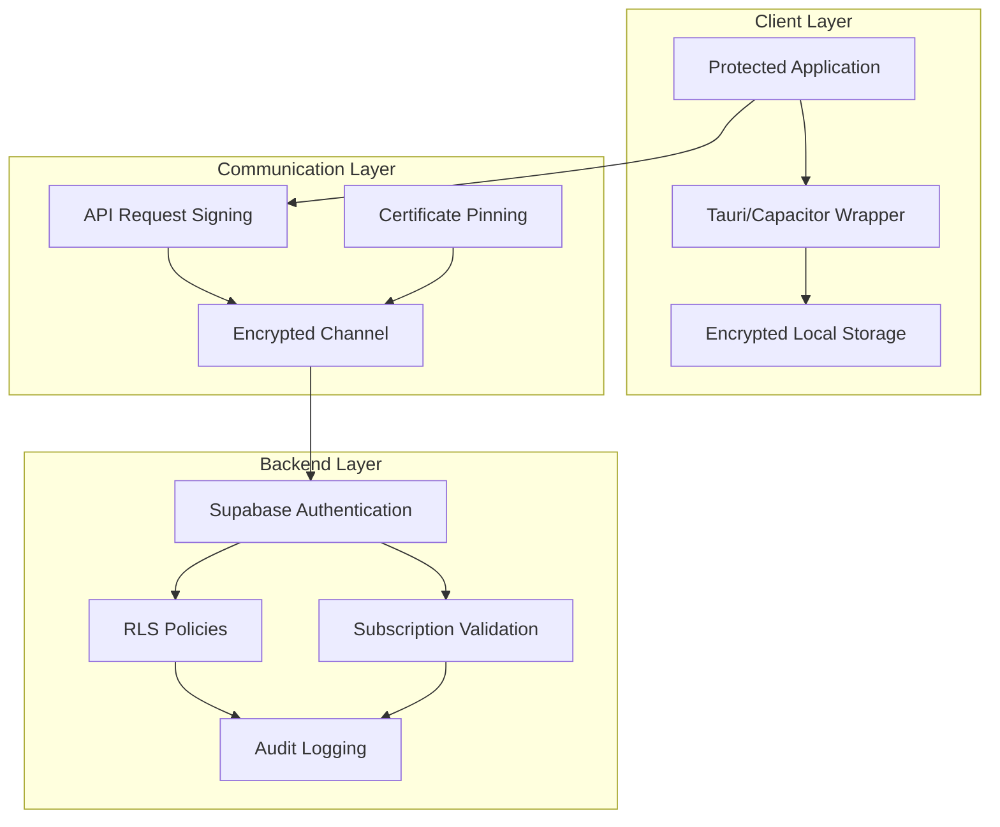

# BMAD Technical Documentation: Business Model Analysis & Development

## Table of Contents
1. [Executive Summary](#executive-summary)
2. [Requirements Analysis](#requirements-analysis)
3. [Security Architecture](#security-architecture)
4. [Business Model Definition](#business-model-definition)
5. [Development Timeline](#development-timeline)
6. [Requirements Traceability Matrix](#requirements-traceability-matrix)
7. [Migration Plan](#migration-plan)
8. [Monetization Guidelines](#monetization-guidelines)

## Executive Summary

The BMAD (Business Model Analysis & Development) workflow represents a comprehensive approach to transforming the ArborIA application into a secure, scalable, and monetizable multi-platform solution. This documentation outlines the technical implementation strategy for achieving content protection, multi-platform distribution, and subscription-based monetization while maintaining the core functionality of the tree management system.

The proposed solution leverages modern technologies including React, TypeScript, Tauri for desktop applications, Capacitor for mobile deployment, and enhanced Supabase backend with Row Level Security (RLS) policies. The architecture prioritizes code protection through compilation, secure API communication, and robust authentication mechanisms.

## Requirements Analysis

### Functional Requirements

#### RF1: Multi-Platform Distribution
- **RF1.1** - Application must run on Android devices via Google Play Store
- **RF1.2** - Application must run on Windows desktop as a native installer
- **RF1.3** - Application must maintain core ArborIA functionality across all platforms
- **RF1.4** - Application must support offline mode with data synchronization
- **RF1.5** - Application must integrate with Supabase backend for data management

#### RF2: Content Protection
- **RF2.1** - Source code must be compiled to prevent direct access
- **RF2.2** - Client-side logic must be obfuscated or compiled
- **RF2.3** - API communication must use encrypted channels
- **RF2.4** - Authentication tokens must be securely stored and managed
- **RF2.5** - Application must validate subscription status at runtime

#### RF3: User Management & Authentication
- **RF3.1** - Support for multi-tenant architecture with role-based access
- **RF3.2** - Integration with Supabase authentication system
- **RF3.3** - Support for 5 user profiles (Mestre, Gestor, Planejador, Executante, Inventariador)
- **RF3.4** - User approval workflow for installations
- **RF3.5** - Password reset and account recovery mechanisms

#### RF4: Core Functionality Preservation
- **RF4.1** - Tree inventory management with risk assessment
- **RF4.2** - Clinometer functionality for height measurement
- **RF4.3** - DAP (Diameter at Breast Height) estimation
- **RF4.4** - Map integration with Leaflet/MapLibre
- **RF4.5** - PDF report generation with embedded maps
- **RF4.6** - Coordinate conversion (UTM/Lat-Lon) with Proj4

#### RF5: Subscription Management
- **RF5.1** - Subscription status validation
- **RF5.2** - Feature access control based on subscription tier
- **RF5.3** - Subscription renewal notifications
- **RF5.4** - Usage tracking and analytics
- **RF5.5** - Billing integration with payment providers

### Non-Functional Requirements

#### RNF1: Security & Privacy
- **RNF1.1** - Zero tolerance for data leakage between installations
- **RNF1.2** - End-to-end encryption for sensitive data transmission
- **RNF1.3** - Secure storage of authentication credentials
- **RNF1.4** - Compliance with GDPR/LGPD regulations
- **RNF1.5** - Audit logging of critical operations

#### RNF2: Performance & Scalability
- **RNF2.1** - Application must load within 3 seconds on standard devices
- **RNF2.2** - Database queries must execute within 50ms (p95)
- **RNF2.3** - Support for 10,000+ installations
- **RNF2.4** - Support for 100,000+ tree records per installation
- **RNF2.5** - Offline functionality must work without internet connection

#### RNF3: Usability & Accessibility
- **RNF3.1** - Mobile-first responsive design
- **RNF3.2** - WCAG 2.1 AA accessibility compliance
- **RNF3.3** - Multi-language support capability
- **RNF3.4** - Intuitive user interface for field work
- **RNF3.5** - Touch-friendly interface for mobile devices

#### RNF4: Reliability & Availability
- **RNF4.1** - 99.5% uptime for backend services
- **RNF4.2** - Automatic backup and recovery mechanisms
- **RNF4.3** - Error handling and graceful degradation
- **RNF4.4** - Offline data synchronization
- **RNF4.5** - Data integrity validation

#### RNF5: Maintainability & Quality
- **RNF5.1** - 80%+ code coverage for critical components
- **RNF5.2** - Comprehensive documentation
- **RNF5.3** - Automated testing pipeline
- **RNF5.4** - Continuous integration/deployment
- **RNF5.5** - Performance monitoring and alerting

## Security Architecture

### Content Protection Model

#### 1. Application Compilation & Distribution
The security architecture implements multiple layers of protection to prevent unauthorized access to the source code and intellectual property:

- **Tauri Framework**: For Windows desktop applications, Tauri compiles the frontend code into a WebAssembly module or bundles it in a way that makes source code extraction significantly more difficult than traditional Electron applications
- **Capacitor Framework**: For Android applications, Capacitor packages the web application into a native container, providing an additional layer of abstraction
- **Code Splitting**: Critical business logic is split into separate modules that are loaded dynamically, making reverse engineering more complex
- **WebAssembly (WASM)**: Core algorithms (such as risk calculation, coordinate conversion) are implemented in Rust and compiled to WASM for enhanced protection

#### 2. Communication Security
- **API Token Management**: Short-lived JWT tokens with role-based permissions
- **Request Signing**: Critical API requests are signed to prevent replay attacks
- **Certificate Pinning**: Mobile applications implement certificate pinning to prevent man-in-the-middle attacks
- **Encrypted Local Storage**: Sensitive data stored locally is encrypted using platform-specific encryption APIs

#### 3. Backend Security Enhancements
Building upon the existing Supabase RLS implementation:

```sql
-- Enhanced RLS policy for additional security
CREATE POLICY "Secure installation access"
  ON arvores FOR ALL
  USING (
    instalacao_id IN (
      SELECT instalacao_id 
      FROM usuarios_instalacoes 
      WHERE user_id = auth.uid() 
      AND status = 'approved'
      AND subscription_valid = true  -- Additional subscription check
    )
    AND auth.role() = 'authenticated'  -- Ensure authenticated access
  );
```

#### 4. Frontend Protection Techniques
- **Obfuscation**: JavaScript code is obfuscated during the build process
- **Environment Variables**: API keys and sensitive configuration are managed through environment variables
- **Dynamic Imports**: Critical functionality is loaded dynamically to prevent static analysis
- **Runtime Checks**: Application validates its environment and subscription status at runtime

### Security Implementation Architecture



## Business Model Definition

### Multi-Platform Distribution Strategy

#### 1. Android Distribution (Google Play Store)
- **App Bundle Format**: Use Google's App Bundle format for optimized APK delivery
- **Device Compatibility**: Support for Android 7.0+ (API level 24)
- **Permissions**: Minimal permissions required for core functionality
- **Privacy Policy**: Comprehensive privacy policy compliant with Google Play requirements
- **Content Rating**: Appropriate content rating for forestry management tools

#### 2. Windows Distribution
- **Installer Format**: MSI or EXE installer using WiX or NSIS
- **System Requirements**: Windows 10+ with .NET runtime if required
- **Update Mechanism**: Automatic update capability built into the application
- **Antivirus Compatibility**: Ensure compatibility with common antivirus software
- **Digital Signature**: Code signing for installer authenticity

### Revenue Model: Subscription-Based

#### 1. Subscription Tiers
- **Free Tier**: Limited functionality, single installation, basic features
- **Professional Tier**: Multiple installations, advanced features, priority support
- **Enterprise Tier**: Unlimited installations, custom features, dedicated support

#### 2. Feature Access Control
- **Tier-Based Feature Locking**: Features enabled/disabled based on subscription
- **Usage Tracking**: Monitor usage to prevent abuse
- **Grace Period**: Allow limited access during payment processing
- **Offline Validation**: Cache subscription status for offline functionality

#### 3. Monetization Strategy
- **Monthly/Annual Subscriptions**: Recurring revenue model
- **Per-Installation Pricing**: Scalable pricing based on number of installations
- **Volume Discounts**: Reduced pricing for multiple installations
- **Enterprise Licensing**: Custom pricing for large organizations

### Market Positioning

#### 1. Target Segments
- **Municipal Governments**: Urban tree management
- **Industrial Plants**: Safety and environmental compliance
- **Educational Institutions**: Campus tree management
- **Environmental Organizations**: Conservation projects
- **Consulting Firms**: Professional forestry services

#### 2. Competitive Advantages
- **Technical Expertise**: Built by forestry professionals
- **Multi-Tenancy**: Support for multiple installations
- **Offline Capability**: Essential for field work
- **Security**: Robust data protection and privacy
- **Integration**: Advanced mapping and measurement tools

## Development Timeline

### Phase 1: Foundation & Security (Weeks 1-8)
**Objective**: Establish secure foundation and core architecture

**Weeks 1-2: Environment Setup**
- Set up development environment with TypeScript
- Configure React project with Vite
- Implement basic authentication with Supabase
- Set up testing framework (Jest + React Testing Library)

**Weeks 3-4: Security Architecture**
- Implement Tauri for Windows application
- Configure Capacitor for Android application
- Set up code obfuscation and compilation pipeline
- Implement WebAssembly modules for critical algorithms

**Weeks 5-6: Backend Integration**
- Enhance Supabase RLS policies
- Implement subscription validation
- Set up audit logging system
- Create API request signing mechanism

**Weeks 7-8: Core Architecture**
- Implement multi-tenant architecture
- Set up feature access control
- Create dynamic module loading system
- Implement offline data synchronization

### Phase 2: Core Functionality Migration (Weeks 9-16)
**Objective**: Migrate existing functionality with enhanced security

**Weeks 9-10: User Management**
- Migrate user authentication system
- Implement role-based access control
- Create user approval workflow
- Set up multi-profile support

**Weeks 11-12: Tree Management**
- Migrate tree inventory system
- Implement risk assessment algorithms
- Create coordinate conversion utilities
- Set up offline data storage

**Weeks 13-14: Measurement Tools**
- Migrate clinometer functionality
- Implement DAP estimation
- Create camera integration for measurements
- Set up image processing pipeline

**Weeks 15-16: Mapping & Reports**
- Migrate map integration with Leaflet
- Implement PDF generation with embedded maps
- Create report templates
- Set up offline map caching

### Phase 3: Platform-Specific Features (Weeks 17-22)
**Objective**: Implement platform-specific capabilities

**Weeks 17-18: Android Implementation**
- Configure Capacitor plugins
- Implement Android-specific UI patterns
- Set up Google Play Store compliance
- Create app icon and assets

**Weeks 19-20: Windows Implementation**
- Configure Tauri plugins
- Implement Windows-specific UI patterns
- Create installer with WiX
- Set up auto-update mechanism

**Weeks 21-22: Cross-Platform Features**
- Implement file system access
- Create platform-specific settings
- Set up notification system
- Implement backup and sync

### Phase 4: Monetization & Distribution (Weeks 23-28)
**Objective**: Implement subscription system and prepare for distribution

**Weeks 23-24: Subscription System**
- Implement subscription validation
- Create payment integration
- Set up billing management
- Implement feature access control

**Weeks 25-26: Testing & QA**
- Comprehensive security testing
- Multi-platform compatibility testing
- Performance optimization
- User acceptance testing

**Weeks 27-28: Distribution Preparation**
- Prepare app store listings
- Create marketing materials
- Set up analytics and monitoring
- Final security review

### Phase 5: Deployment & Launch (Weeks 29-32)
**Objective**: Deploy to app stores and monitor performance

**Weeks 29-30: App Store Submission**
- Submit to Google Play Store
- Prepare Windows installer distribution
- Set up app store management
- Create support documentation

**Weeks 31-32: Launch & Monitoring**
- Monitor application performance
- Collect user feedback
- Implement bug fixes
- Plan for future enhancements

## Requirements Traceability Matrix

| Requirement ID | Description | Phase | Platform | Priority | Status | Test Case |
|----------------|-------------|-------|----------|----------|--------|-----------|
| RF1.1 | Android distribution | Phase 3 | Android | High | Planned | TC_RF1.1 |
| RF1.2 | Windows distribution | Phase 3 | Windows | High | Planned | TC_RF1.2 |
| RF1.3 | Cross-platform functionality | All | All | Critical | Planned | TC_RF1.3 |
| RF1.4 | Offline capability | Phase 1 | All | High | Planned | TC_RF1.4 |
| RF1.5 | Supabase integration | Phase 1 | All | Critical | Planned | TC_RF1.5 |
| RF2.1 | Source code compilation | Phase 1 | All | Critical | Planned | TC_RF2.1 |
| RF2.2 | Code obfuscation | Phase 1 | All | High | Planned | TC_RF2.2 |
| RF2.3 | Encrypted communication | Phase 1 | All | Critical | Planned | TC_RF2.3 |
| RF2.4 | Secure token storage | Phase 1 | All | Critical | Planned | TC_RF2.4 |
| RF2.5 | Subscription validation | Phase 4 | All | High | Planned | TC_RF2.5 |
| RF3.1 | Multi-tenant support | Phase 2 | All | Critical | Planned | TC_RF3.1 |
| RF3.2 | Supabase auth integration | Phase 1 | All | Critical | Planned | TC_RF3.2 |
| RF3.3 | 5 user profiles | Phase 2 | All | High | Planned | TC_RF3.3 |
| RF3.4 | User approval workflow | Phase 2 | All | High | Planned | TC_RF3.4 |
| RF3.5 | Account recovery | Phase 2 | All | Medium | Planned | TC_RF3.5 |
| RF4.1 | Tree inventory management | Phase 2 | All | Critical | Planned | TC_RF4.1 |
| RF4.2 | Clinometer functionality | Phase 2 | All | High | Planned | TC_RF4.2 |
| RF4.3 | DAP estimation | Phase 2 | All | High | Planned | TC_RF4.3 |
| RF4.4 | Map integration | Phase 2 | All | High | Planned | TC_RF4.4 |
| RF4.5 | PDF generation | Phase 2 | All | High | Planned | TC_RF4.5 |
| RF4.6 | Coordinate conversion | Phase 2 | All | High | Planned | TC_RF4.6 |
| RF5.1 | Subscription validation | Phase 4 | All | High | Planned | TC_RF5.1 |
| RF5.2 | Feature access control | Phase 4 | All | High | Planned | TC_RF5.2 |
| RF5.3 | Renewal notifications | Phase 4 | All | Medium | Planned | TC_RF5.3 |
| RF5.4 | Usage tracking | Phase 4 | All | Medium | Planned | TC_RF5.4 |
| RF5.5 | Billing integration | Phase 4 | All | High | Planned | TC_RF5.5 |
| RNF1.1 | Zero data leakage | All | All | Critical | Planned | TC_RNF1.1 |
| RNF1.2 | E2E encryption | Phase 1 | All | Critical | Planned | TC_RNF1.2 |
| RNF1.3 | Secure credential storage | Phase 1 | All | Critical | Planned | TC_RNF1.3 |
| RNF1.4 | GDPR/LGPD compliance | All | All | High | Planned | TC_RNF1.4 |
| RNF1.5 | Audit logging | Phase 1 | All | High | Planned | TC_RNF1.5 |
| RNF2.1 | 3-second load time | All | All | High | Planned | TC_RNF2.1 |
| RNF2.2 | 50ms query time | Phase 1 | All | High | Planned | TC_RNF2.2 |
| RNF2.3 | 10k+ installations | Phase 1 | All | High | Planned | TC_RNF2.3 |
| RNF2.4 | 100k+ tree records | Phase 1 | All | High | Planned | TC_RNF2.4 |
| RNF2.5 | Offline functionality | All | All | Critical | Planned | TC_RNF2.5 |
| RNF3.1 | Mobile-first design | All | All | High | Planned | TC_RNF3.1 |
| RNF3.2 | WCAG 2.1 AA compliance | All | All | Medium | Planned | TC_RNF3.2 |
| RNF3.3 | Multi-language support | Phase 4 | All | Medium | Planned | TC_RNF3.3 |
| RNF3.4 | Intuitive UI | All | All | High | Planned | TC_RNF3.4 |
| RNF3.5 | Touch-friendly interface | All | All | High | Planned | TC_RNF3.5 |
| RNF4.1 | 99.5% uptime | All | All | Critical | Planned | TC_RNF4.1 |
| RNF4.2 | Backup/recovery | All | All | High | Planned | TC_RNF4.2 |
| RNF4.3 | Error handling | All | All | High | Planned | TC_RNF4.3 |
| RNF4.4 | Offline sync | All | All | Critical | Planned | TC_RNF4.4 |
| RNF4.5 | Data integrity | All | All | Critical | Planned | TC_RNF4.5 |
| RNF5.1 | 80%+ test coverage | All | All | High | Planned | TC_RNF5.1 |
| RNF5.2 | Comprehensive docs | All | All | High | Planned | TC_RNF5.2 |
| RNF5.3 | Automated testing | All | All | High | Planned | TC_RNF5.3 |
| RNF5.4 | CI/CD pipeline | All | All | High | Planned | TC_RNF5.4 |
| RNF5.5 | Performance monitoring | All | All | High | Planned | TC_RNF5.5 |

## Migration Plan

### Current Technology Stack Assessment

#### Technologies to Migrate From:
- **Frontend**: Vanilla JavaScript, HTML, CSS with modular architecture
- **Backend**: Supabase (PostgreSQL, Auth, Storage, RLS)
- **Build System**: Manual build process
- **Mobile**: PWA with service worker
- **Desktop**: PWA with browser installation

#### Technologies to Migrate To:
- **Frontend**: React 18+, TypeScript, Vite
- **Backend**: Supabase (enhanced with additional security)
- **Build System**: Vite with TypeScript compilation
- **Mobile**: Capacitor with React integration
- **Desktop**: Tauri with React integration
- **State Management**: Zustand or Redux Toolkit
- **Styling**: Tailwind CSS or styled-components

### Migration Strategy

#### 1. Incremental Migration Approach
The migration will follow a component-by-component approach to minimize risk and maintain functionality:

**Phase A: Foundation Setup**
1. Set up new React/TypeScript project alongside existing codebase
2. Implement authentication system with Supabase
3. Create component library for existing functionality
4. Set up testing framework and CI/CD pipeline

**Phase B: Core Components Migration**
1. Migrate tree inventory components
2. Migrate map integration components
3. Migrate user management components
4. Migrate coordinate conversion utilities

**Phase C: Advanced Features Migration**
1. Migrate clinometer functionality
2. Migrate DAP estimation tools
3. Migrate PDF generation
4. Migrate offline synchronization

**Phase D: Platform Integration**
1. Integrate with Tauri for Windows
2. Integrate with Capacitor for Android
3. Test cross-platform functionality
4. Optimize for platform-specific requirements

#### 2. Data Migration Strategy
- **Database Schema**: Maintain existing Supabase schema with security enhancements
- **User Data**: Preserve all existing user data during migration
- **Configuration**: Migrate user preferences and settings
- **Offline Data**: Implement migration path for local data storage

#### 3. Testing Strategy
- **Unit Testing**: Implement comprehensive unit tests for all components
- **Integration Testing**: Test component interactions and API integrations
- **Security Testing**: Penetration testing and vulnerability assessment
- **Performance Testing**: Load testing and performance optimization
- **Cross-Platform Testing**: Test on all target platforms

### Risk Mitigation

#### 1. Technical Risks
- **Risk**: Compatibility issues with existing Supabase backend
  - **Mitigation**: Maintain backward compatibility during migration
  - **Contingency**: Rollback plan to original system if needed

- **Risk**: Performance degradation with new architecture
  - **Mitigation**: Performance testing at each migration phase
  - **Contingency**: Optimize critical paths before full deployment

- **Risk**: Loss of offline functionality
  - **Mitigation**: Preserve service worker functionality during migration
  - **Contingency**: Maintain PWA functionality as backup

#### 2. Security Risks
- **Risk**: Vulnerabilities in new framework components
  - **Mitigation**: Regular security audits and dependency updates
  - **Contingency**: Security patching process and monitoring

- **Risk**: Inadequate protection against reverse engineering
  - **Mitigation**: Multiple layers of protection (compilation, obfuscation, WASM)
  - **Contingency**: Continuous security assessment and improvement

#### 3. Operational Risks
- **Risk**: Extended development timeline
  - **Mitigation**: Phased development with regular milestones
  - **Contingency**: Prioritized feature delivery based on business value

- **Risk**: User adoption challenges
  - **Mitigation**: User feedback integration and gradual feature rollout
  - **Contingency**: Support for both old and new interfaces during transition

### Success Metrics

#### 1. Technical Metrics
- **Performance**: 95% of pages load in under 3 seconds
- **Security**: Zero critical vulnerabilities identified in security audit
- **Compatibility**: 95% of existing functionality preserved
- **Test Coverage**: 80%+ code coverage for critical components

#### 2. Business Metrics
- **User Adoption**: 80% of active users migrate within 3 months
- **Platform Distribution**: Successful deployment to both platforms
- **Subscription Conversion**: 20% conversion rate from free to paid tier
- **Revenue Growth**: 50% increase in recurring revenue within 6 months

## Monetization Guidelines

### Subscription Model Implementation

#### 1. Feature Tier Structure
The subscription model will implement a tiered feature structure with clear value propositions:

**Free Tier (ArborIA Basic)**
- Single installation management
- Basic tree inventory (up to 100 trees)
- Standard risk assessment
- PWA access only
- Community support

**Professional Tier ($49/month per installation)**
- Up to 5 installations
- Unlimited trees per installation
- Advanced risk assessment (15 criteria)
- Mobile app access (Android)
- Desktop app access (Windows)
- Priority email support
- Advanced reporting features

**Enterprise Tier ($99/month per installation)**
- Unlimited installations
- Unlimited trees
- Custom risk assessment criteria
- Advanced analytics and insights
- API access for integrations
- White-glove onboarding
- 24/7 phone support
- Custom branding options

#### 2. Technical Implementation

```typescript
// Subscription validation service
interface SubscriptionValidationService {
  validateSubscription(userId: string): Promise<SubscriptionStatus>;
  getAvailableFeatures(userId: string): Promise<FeatureList>;
  trackUsage(userId: string, feature: string): Promise<void>;
  checkFeatureAccess(userId: string, feature: string): Promise<boolean>;
}

// Feature access control
const FeatureAccessControl = {
  // Free tier features
  FREE_TIER: [
    'tree_inventory_basic',
    'standard_risk_assessment',
    'basic_reports',
    'single_installation'
  ],
  
  // Professional tier features
  PROFESSIONAL_TIER: [
    'tree_inventory_unlimited',
    'advanced_risk_assessment',
    'mobile_app_access',
    'desktop_app_access',
    'advanced_reports',
    'multi_installation'
  ],
  
  // Enterprise tier features
  ENTERPRISE_TIER: [
    'unlimited_installations',
    'custom_risk_criteria',
    'advanced_analytics',
    'api_access',
    'custom_branding'
  ]
};
```

#### 3. Payment Integration

**Payment Providers:**
- Stripe for credit card processing
- PayPal for alternative payment method
- Google Play Billing for in-app purchases on Android
- Apple App Store Billing for iOS (future expansion)

**Billing Management:**
- Automated recurring billing
- Proration for plan changes
- Grace periods for payment failures
- Dunning management for failed payments

#### 4. Usage Tracking & Analytics

**Tracking Implementation:**
- Event-based tracking for feature usage
- Installation and tree count monitoring
- Subscription status validation
- Revenue attribution by feature

**Analytics Dashboard:**
- Subscription conversion rates
- Feature usage patterns
- Revenue per user
- Churn rate analysis

#### 5. Monetization Security

**Subscription Validation:**
- Server-side validation of subscription status
- Client-side caching with periodic refresh
- Offline mode with grace period
- Tamper detection and response

**Revenue Protection:**
- Multiple validation points
- Usage-based feature limits
- Automated detection of unauthorized access
- Legal compliance for different jurisdictions

### Implementation Guidelines

#### 1. Development Best Practices
- Implement feature flags for easy tier management
- Use centralized subscription validation service
- Implement graceful degradation for offline scenarios
- Maintain detailed audit logs for compliance

#### 2. User Experience Considerations
- Clear value proposition for each tier
- Seamless upgrade/downgrade process
- Transparent usage tracking
- Helpful onboarding for new subscribers

#### 3. Legal & Compliance Requirements
- GDPR/LGPD compliance for European/BR users
- App store compliance for mobile platforms
- Tax compliance for different jurisdictions
- Terms of service and privacy policy updates

### Success Metrics for Monetization

#### 1. Revenue Metrics
- Monthly Recurring Revenue (MRR)
- Annual Recurring Revenue (ARR)
- Average Revenue Per User (ARPU)
- Customer Lifetime Value (CLV)

#### 2. Adoption Metrics
- Free to paid conversion rate
- Subscription upgrade rate
- Feature adoption by tier
- Platform-specific conversion rates

#### 3. Retention Metrics
- Monthly churn rate
- Customer acquisition cost (CAC)
- Time to value for new subscribers
- Support ticket volume by tier

This comprehensive monetization strategy ensures sustainable revenue growth while providing clear value to users at each tier, with robust security measures to protect the business model.