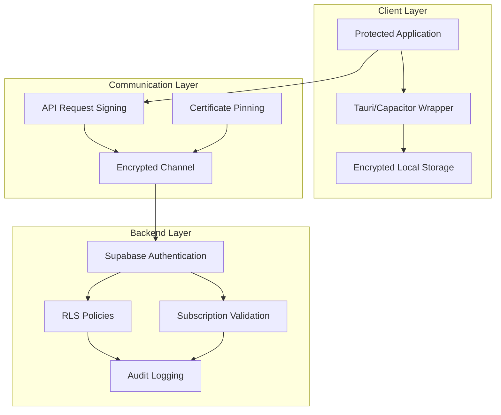

# BMAD Workflow Initialization Documentation

## Overview
This document provides comprehensive documentation for initializing the BMAD (Business Model Analysis & Development) workflow for the ArborIA application. The workflow transforms the existing tree management system into a secure, scalable, and monetizable multi-platform solution.

## Project Context
The ArborIA application is a comprehensive tree management system designed for forestry professionals. The BMAD workflow aims to enhance the application by:
- Implementing multi-platform distribution (Android and Windows)
- Adding content protection mechanisms
- Introducing subscription-based monetization
- Enhancing security architecture

## Initialization Process

### Phase 1: Environment Setup and Configuration
1. **Project Assessment**
   - Review existing codebase structure
   - Identify core components that need migration
   - Document current functionality and dependencies

2. **BMAD Configuration**
   - Load user preferences from `.bmad/core/config.yaml`
   - Set up workflow configuration in `.bmad/workflow-config.yaml`
   - Initialize output directories for documentation and reports

3. **Development Environment**
   - Configure TypeScript and React development tools
   - Set up Supabase integration with enhanced security
   - Install Tauri and Capacitor for multi-platform builds

### Phase 2: Security Architecture Implementation
1. **Content Protection**
   - Implement Tauri for Windows desktop application
   - Configure Capacitor for Android mobile application
   - Set up code compilation and obfuscation pipeline
   - Create WebAssembly modules for critical algorithms

2. **Communication Security**
   - Implement API request signing mechanism
   - Set up certificate pinning for mobile applications
   - Configure encrypted local storage for sensitive data
   - Enhance Supabase RLS policies with subscription validation

### Phase 3: Multi-Platform Distribution
1. **Android Implementation**
   - Configure Capacitor plugins for native functionality
   - Implement Android-specific UI patterns
   - Ensure Google Play Store compliance
   - Create app icons and assets

2. **Windows Implementation**
   - Configure Tauri plugins for desktop functionality
   - Implement Windows-specific UI patterns
   - Create installer with WiX or NSIS
   - Set up auto-update mechanism

### Phase 4: Monetization System
1. **Subscription Model**
   - Implement subscription validation service
   - Create feature access control system
   - Set up payment integration (Stripe/Google Play Billing)
   - Implement usage tracking and analytics

2. **Tier Management**
   - Free tier: Basic functionality with limitations
   - Professional tier: Enhanced features and multi-platform access
   - Enterprise tier: Unlimited access with custom features

### Phase 5: Migration and Testing
1. **Component Migration**
   - Incremental migration approach
   - Preserve existing functionality
   - Maintain backward compatibility
   - Comprehensive testing at each phase

2. **Quality Assurance**
   - Unit testing with 80%+ coverage
   - Integration testing for all components
   - Security testing and vulnerability assessment
   - Cross-platform compatibility testing

## Technical Architecture

### Security Implementation
The security architecture implements multiple layers of protection:



### Subscription Validation Service
```typescript
interface SubscriptionValidationService {
  validateSubscription(userId: string): Promise<SubscriptionStatus>;
  getAvailableFeatures(userId: string): Promise<FeatureList>;
  trackUsage(userId: string, feature: string): Promise<void>;
  checkFeatureAccess(userId: string, feature: string): Promise<boolean>;
}
```

## Configuration Files

### Workflow Configuration
The `.bmad/workflow-config.yaml` file contains all the configuration parameters for the BMAD workflow:

- **Security Settings**: Content protection, communication security, backend enhancements
- **Platform Targets**: Android and Windows distribution parameters
- **Monetization Settings**: Subscription tiers and validation rules
- **Migration Settings**: Strategy and phase configuration

### Feature Access Control
The system implements tier-based feature access control:

```typescript
const FeatureAccessControl = {
 // Free tier features
  FREE_TIER: [
    'tree_inventory_basic',
    'standard_risk_assessment',
    'basic_reports',
    'single_installation'
  ],
  
  // Professional tier features
  PROFESSIONAL_TIER: [
    'tree_inventory_unlimited',
    'advanced_risk_assessment',
    'mobile_app_access',
    'desktop_app_access',
    'advanced_reports',
    'multi_installation'
  ],
  
  // Enterprise tier features
  ENTERPRISE_TIER: [
    'unlimited_installations',
    'custom_risk_criteria',
    'advanced_analytics',
    'api_access',
    'custom_branding'
  ]
};
```

## Implementation Guidelines

### Development Best Practices
- Implement feature flags for easy tier management
- Use centralized subscription validation service
- Implement graceful degradation for offline scenarios
- Maintain detailed audit logs for compliance

### User Experience Considerations
- Clear value proposition for each tier
- Seamless upgrade/downgrade process
- Transparent usage tracking
- Helpful onboarding for new subscribers

### Legal & Compliance Requirements
- GDPR/LGPD compliance for European/BR users
- App store compliance for mobile platforms
- Tax compliance for different jurisdictions
- Terms of service and privacy policy updates

## Success Metrics

### Technical Metrics
- Performance: 95% of pages load in under 3 seconds
- Security: Zero critical vulnerabilities identified in security audit
- Compatibility: 95% of existing functionality preserved
- Test Coverage: 80%+ code coverage for critical components

### Business Metrics
- User Adoption: 80% of active users migrate within 3 months
- Platform Distribution: Successful deployment to both platforms
- Subscription Conversion: 20% conversion rate from free to paid tier
- Revenue Growth: 50% increase in recurring revenue within 6 months

## Risk Management

### Technical Risks
- **Risk**: Compatibility issues with existing Supabase backend
  - **Mitigation**: Maintain backward compatibility during migration
  - **Contingency**: Rollback plan to original system if needed

- **Risk**: Performance degradation with new architecture
  - **Mitigation**: Performance testing at each migration phase
  - **Contingency**: Optimize critical paths before full deployment

### Security Risks
- **Risk**: Vulnerabilities in new framework components
  - **Mitigation**: Regular security audits and dependency updates
  - **Contingency**: Security patching process and monitoring

- **Risk**: Inadequate protection against reverse engineering
  - **Mitigation**: Multiple layers of protection (compilation, obfuscation, WASM)
  - **Contingency**: Continuous security assessment and improvement

## Next Steps

1. Execute Phase 1: Environment Setup and Configuration
2. Implement security architecture
3. Configure multi-platform distribution
4. Integrate subscription system
5. Begin component migration
6. Conduct comprehensive testing
7. Prepare for deployment

## Conclusion

The BMAD workflow initialization provides a comprehensive roadmap for transforming the ArborIA application into a secure, monetizable, multi-platform solution. The implementation follows a phased approach to minimize risk while maximizing the value delivered to users at each tier.

This documentation serves as the foundation for the entire workflow execution and should be referenced throughout the implementation process.