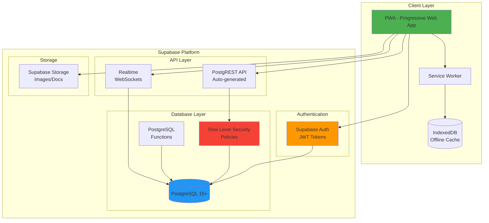
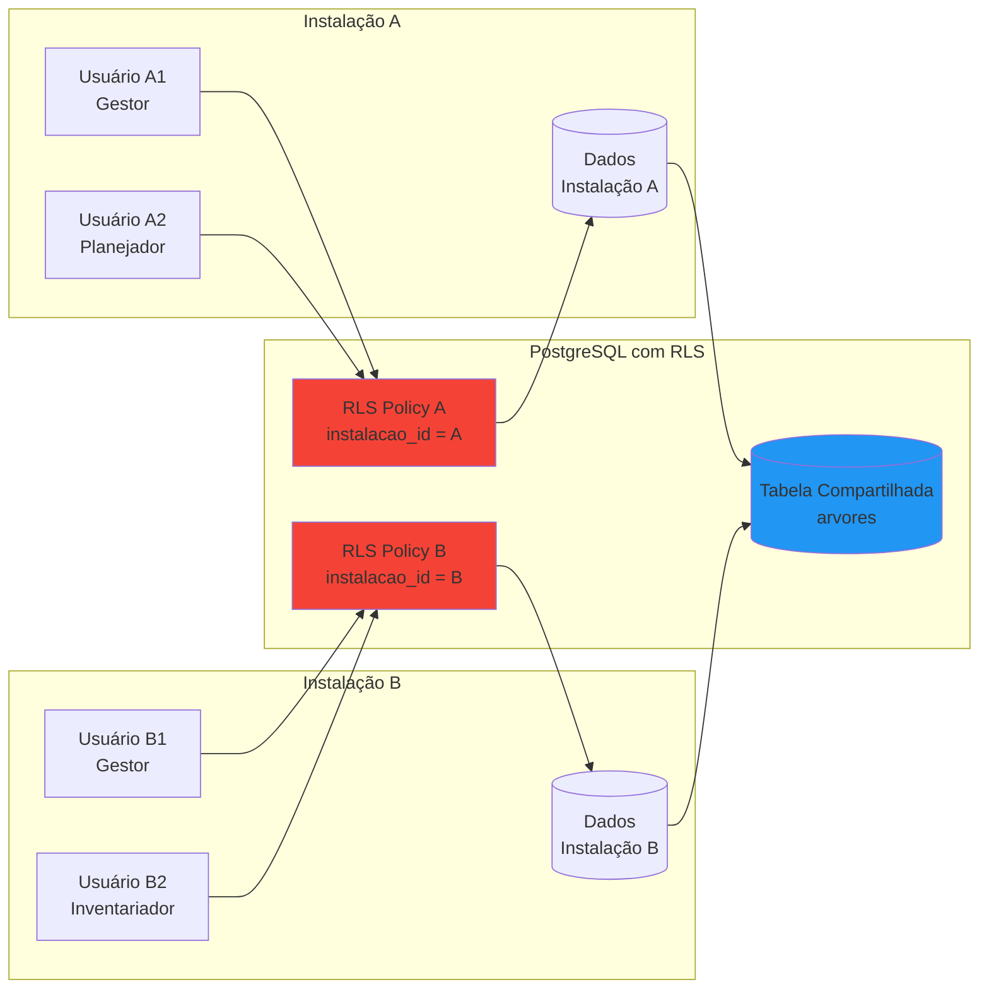
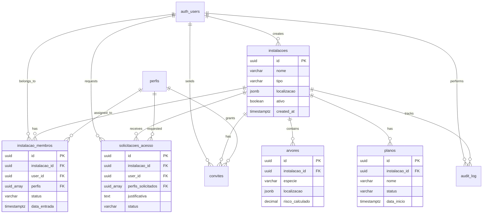
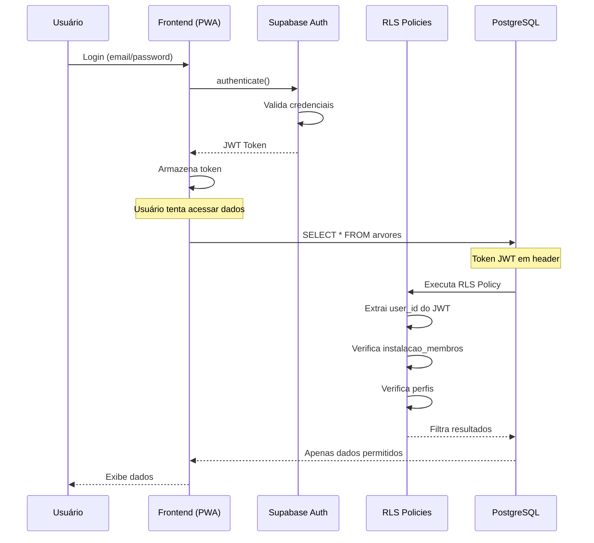
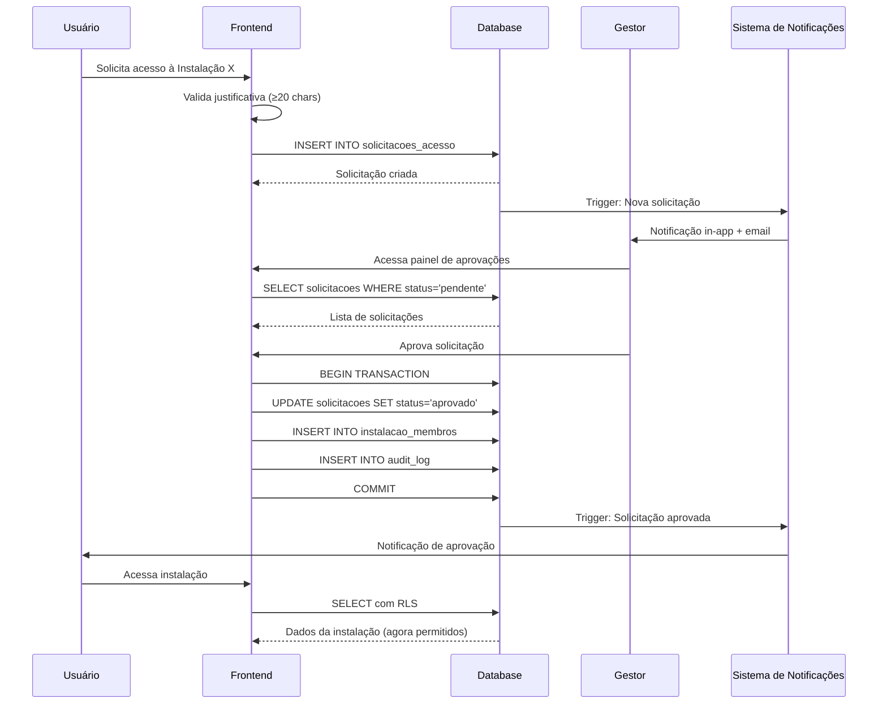

---

# Product Requirements Document - ArborIA - webAPP - BMAD

**Author:** Ammon  
**Date:** 2025-12-09  
**Version:** 1.0  
**Status:** ✅ Complete - Ready for Implementation

---

## 📋 Índice

1. [Executive Summary](#executive-summary)
   - Visão do Produto
   - O Problema que Resolve
   - A Solução: Sistema de Instalações com RBAC
   - Arquitetura de Perfis de Usuário
   - Jornadas de Usuário Críticas
   - Métricas de Sucesso

2. [Projeto Classification](#projeto-classification)
   - Fundação Técnica Existente
   - Considerações Técnicas Críticas
   - Critérios de Qualidade e Segurança
   - Faseamento da Implementação

3. [Requisitos Detalhados](#requisitos-detalhados)
   - Requisitos Funcionais (RF1-RF7)
   - Requisitos Não-Funcionais (RNF1-RNF5)
   - Matriz de Priorização

4. [User Stories](#user-stories)
   - US-MESTRE (4 stories - 13 SP)
   - US-GESTOR (7 stories - 34 SP)
   - US-PLANEJADOR (5 stories - 22 SP)
   - US-EXECUTANTE (8 stories - 39 SP)
   - US-INVENTARIADOR (5 stories - 27 SP)
   - US-COMUM (5 stories - 17 SP)
   - Matriz de Dependências
   - Resumo de Esforço por Perfil

5. [Technical Architecture](#technical-architecture)
   - Visão Geral da Arquitetura
   - Stack Tecnológico
   - Modelo de Multi-Tenancy
   - Modelo de Dados (Database Schema)
   - Row Level Security (RLS) Policies
   - Fluxos de Autenticação e Autorização
   - Estratégia de Migração de Dados
   - Otimizações de Performance
   - Padrões de Implementação Frontend
   - Monitoramento e Observabilidade

---

## 📊 Sumário de Revisão do Documento

### Estatísticas do PRD

| Métrica | Valor |
|---------|-------|
| **Total de Linhas** | 2.345 linhas |
| **Total de Seções** | 5 seções principais |
| **Requisitos Funcionais** | 7 categorias (RF1-RF7) |
| **Requisitos Não-Funcionais** | 5 categorias (RNF1-RNF5) |
| **User Stories** | 34 histórias detalhadas |
| **Story Points Totais** | 152 SP |
| **Tabelas de Banco de Dados** | 7 tabelas novas + 2 modificadas |
| **Diagramas Mermaid** | 5 diagramas técnicos |
| **Código SQL** | ~500 linhas de schema + RLS |
| **Código JavaScript** | ~200 linhas de exemplos |

### Completude do Documento

| Seção | Status | Qualidade | Notas |
|-------|--------|-----------|-------|
| Executive Summary | ✅ Completo | ⭐⭐⭐⭐⭐ | Visão clara, problema bem definido, solução detalhada |
| Project Classification | ✅ Completo | ⭐⭐⭐⭐⭐ | Contexto técnico, riscos e mitigações |
| Requisitos Detalhados | ✅ Completo | ⭐⭐⭐⭐⭐ | 6 RF + 5 RNF com critérios de aceitação |
| User Stories | ✅ Completo | ⭐⭐⭐⭐⭐ | 30 stories com estimativas e dependências |
| Technical Architecture | ✅ Completo | ⭐⭐⭐⭐⭐ | Schema completo, RLS, migração, código |

### Principais Destaques

✅ **Pronto para Implementação**
- Schema de banco de dados completo e executável
- Políticas RLS prontas para deploy
- Código de exemplo para frontend
- Estratégia de migração zero-downtime

✅ **Documentação Técnica Excepcional**
- 5 diagramas Mermaid (arquitetura, ERD, fluxos)
- ~500 linhas de SQL pronto para uso
- Padrões de implementação frontend
- Decisões arquiteturais documentadas

✅ **Planejamento Detalhado**
- 30 user stories com critérios de aceitação
- Estimativas de esforço (128 SP total)
- Matriz de dependências
- Timeline de 6-7 sprints (~3-3.5 meses)

✅ **Segurança e Qualidade**
- Zero tolerância para data leakage
- 100% cobertura de testes em RLS
- Audit trail completo
- LGPD/GDPR compliance

### Estimativas de Implementação

**Fase 1 - Backend (P0):**
- Duração: ~3 sprints (6 semanas)
- Esforço: ~60 SP
- Entregas: Schema, RLS, migração, testes

**Fase 2 - Frontend (P0+P1):**
- Duração: ~3-4 sprints (6-8 semanas)
- Esforço: ~68 SP
- Entregas: UI, workflows, notificações

**Total Estimado:**
- **Duração:** 6-7 sprints (3-3.5 meses)
- **Esforço:** 128 SP
- **Velocity Assumida:** 20 SP/sprint

### Riscos Identificados e Mitigações

| Risco | Severidade | Mitigação |
|-------|-----------|-----------|
| Data leakage entre instalações | 🔴 Crítico | RLS obrigatório + testes 100% cobertura |
| Performance de queries com RLS | 🟡 Médio | Índices compostos + cache de auth.uid() |
| Migração de dados existentes | 🟡 Médio | Script testado + rollback plan |
| Complexidade de permissões | 🟢 Baixo | Funções helper + documentação clara |

### Próximos Passos Recomendados

1. **Revisão Stakeholders** (1-2 dias)
   - Apresentar PRD para equipe técnica
   - Validar estimativas e prioridades
   - Ajustar se necessário

2. **Setup de Ambiente** (2-3 dias)
   - Criar ambiente de staging
   - Configurar CI/CD
   - Setup de testes automatizados

3. **Sprint 0 - Preparação** (1 sprint)
   - Criar schema em staging
   - Implementar RLS policies
   - Testes de isolamento
   - Validar performance

4. **Início da Fase 1** (Sprint 1)
   - Implementar RF1.1 (Criação de Instalação)
   - Implementar RF2.1 (Sistema de Perfis)
   - Testes de integração

---

## Executive Summary

### Visão do Produto

O ArborIA está evoluindo de uma ferramenta de gestão arbórea individual para uma **plataforma multi-tenant de gestão arbórea profissional**, permitindo que múltiplas instalações (plantas industriais, municípios, campi corporativos) utilizem a mesma infraestrutura técnica enquanto mantêm isolamento completo de dados e equipes independentes.

Esta evolução surge de uma necessidade crítica identificada no mercado de gestão arbórea industrial: **a falta de padronização técnica e a dependência de serviços especializados de qualidade inconsistente**. Como engenheiro florestal especialista, o criador do ArborIA identificou que gestores de instalações industriais frequentemente carecem do conhecimento técnico necessário para avaliar riscos arbóreos e planejar intervenções de forma adequada, resultando em vulnerabilidades de segurança e decisões ambientalmente subótimas.

### O Problema que Resolve

**Contexto de Mercado Real:**

O criador do ArborIA participou pessoalmente de **bancas de investigação de acidentes envolvendo árvores e operações com motosserras** em ambientes corporativos. Esses acidentes têm impacto devastador em empresas como Petrobras e outras que precisam manter imagem de **segurança e sustentabilidade** perante o mercado.

**Problemas Críticos:**
- Instalações industriais dependem de empresas especializadas que frequentemente entregam resultados insatisfatórios
- Gestores sem formação em engenharia florestal precisam tomar decisões críticas sobre segurança arbórea
- Falta de padronização na avaliação de risco arbóreo entre diferentes prestadores de serviço
- **Risco reputacional e operacional:** Acidentes com árvores comprometem a imagem corporativa de segurança e sustentabilidade
- Dificuldade em manter histórico e continuidade de gestão arbórea

**Limitação Atual do ArborIA:**
O sistema atual isola dados por usuário individual, impedindo colaboração entre equipes de uma mesma instalação e impossibilitando o uso da plataforma por múltiplas organizações independentes.

### A Solução: Sistema de Instalações com RBAC

A nova funcionalidade de **Instalações** transforma o ArborIA em uma plataforma SaaS multi-tenant que:

1. **Democratiza Expertise Técnica:** Codifica conhecimento especializado de engenharia florestal em uma ferramenta intuitiva que gestores sem formação técnica podem usar com confiança

2. **Padroniza Excelência:** Garante que todas as avaliações de risco e planejamentos de intervenção sigam a mesma metodologia técnica rigorosa (15 critérios ponderados de risco)

3. **Habilita Colaboração:** Permite que equipes completas de uma instalação trabalhem juntas com visibilidade compartilhada e controle de acesso granular

4. **Eleva Imagem Corporativa:** Gestores podem demonstrar implementação de **tecnologia inovadora** em gestão de segurança e sustentabilidade, valorizando suas carreiras profissionais

5. **Escala Operações:** Permite que prestadores de serviço especializados gerenciem múltiplas instalações clientes de forma profissional

6. **Garante Segurança de Dados:** Isolamento total entre instalações usando Row Level Security (RLS) do PostgreSQL

### Arquitetura de Perfis de Usuário

O sistema implementa **5 níveis de perfis** integrados em uma solução única:

| Perfil | Escopo | Permissões Principais | Papel no Workflow |
|--------|--------|----------------------|-------------------|
| **Mestre** | Global (todas instalações) | Acesso total, aprovação de gestores, gerenciamento de instalações | Administração do sistema |
| **Gestor** | Instalação específica | Acesso total à instalação, aprovação de usuários, gerenciamento de equipe, visão estratégica de longo prazo | Tomada de decisão baseada em planejamento |
| **Planejador** | Instalação específica | Edição de planos de intervenção, acesso ao inventário arbóreo | **Papel crítico:** Criação de planos detalhados para execução |
| **Executante** | Instalação específica | Leitura de planos de intervenção (somente visualização) | Execução de trabalho baseada em planos |
| **Inventariador** | Instalação específica | Coleta de dados de campo, levantamento arbóreo | **Fase imprescindível:** Descoberta de passivo e determinação de escopo |

**Características Únicas:**
- ✅ Usuários podem ter **múltiplos perfis** simultaneamente
- ✅ Perfis são **específicos por instalação** (um usuário pode ser Gestor em uma instalação e Planejador em outra)
- ✅ Módulo de **Educação e Treinamento** acessível por todos os perfis
- ✅ Sistema de **aprovação de cadastros** (exceto gestores que são convidados)

**Dependências de Workflow:**
- **Inventariador → Gestor:** Coleta de dados alimenta decisões estratégicas
- **Planejador → Executante:** Planos detalhados garantem entendimento comum do trabalho
- **Gestor:** Visão de longo alcance, decisões baseadas em planejamento (não execução direta)

**Justificativa para Todos os Perfis:**
Todos os 5 perfis são necessários para validar o modelo de negócio, pois o ArborIA oferece uma **solução única integrada** que cobre todo o ciclo de gestão arbórea - desde levantamento até execução - com diferentes papéis colaborando de forma orquestrada.

### O que Torna Isso Especial

**Transformação de Conhecimento em Software:**
O ArborIA não é apenas uma ferramenta de gestão - é a **codificação de expertise de engenharia florestal** em um sistema que eleva o padrão técnico de toda a indústria de gestão arbórea.

**Valor Único para Stakeholders:**

**Para Gestores de Instalação:**
- **Segurança:** Prevenção de acidentes que comprometem reputação corporativa
- **Carreira:** Implementação de tecnologia inovadora valoriza perfil profissional
- **Autonomia:** Redução de dependência de consultores externos inconsistentes

**Para Empresas (Petrobras, Indústrias):**
- **Imagem Corporativa:** Demonstração de compromisso com segurança e sustentabilidade
- **Conformidade:** Padronização técnica auditável
- **Redução de Risco:** Prevenção de acidentes operacionais

**Momento "Finalmente!":**
Quando um gestor de planta industrial consegue:
- Avaliar o risco de uma árvore com confiança profissional usando critérios técnicos validados
- Planejar intervenções detalhadas sem depender de consultores externos de qualidade duvidosa
- Gerar laudos técnicos profissionais automaticamente
- Ter visibilidade completa e controle do componente arbóreo da instalação
- Colaborar com sua equipe de forma segura e organizada
- **Demonstrar para a diretoria:** Implementação de tecnologia de ponta em gestão de segurança

### Jornadas de Usuário Críticas

#### Jornada 1: Onboarding de Primeira Instalação (Gestor)

1. **Login Inicial:** Gestor faz login via convite (pré-aprovado)
2. **Página de Instalações:** Direcionado para página de cadastro/visualização de instalações
3. **Criação de Instalação:** Cadastra nova instalação (nome, tipo, localização)
4. **Dashboard Gestor:** Acessa dashboard com indicador de aprovações pendentes sempre visível
5. **Convite de Equipe:** Envia convites para inventariadores e planejadores

#### Jornada 2: Solicitação e Aprovação de Acesso (Usuário Regular)

1. **Tentativa de Acesso:** Usuário tenta acessar instalação sem permissão
2. **Tela de Erro:** Recebe mensagem clara solicitando contato com gestor
3. **Solicitação de Acesso:** Envia solicitação especificando perfis desejados
4. **Notificação ao Gestor:** Gestor recebe notificação no app + email
5. **Aprovação/Rejeição:** Gestor revisa e aprova/rejeita com justificativa
6. **Confirmação:** Usuário recebe notificação de aprovação e pode acessar

#### Jornada 3: Troca Entre Instalações (Usuário Multi-Instalação)

1. **Login:** Usuário faz login no sistema
2. **Seleção de Instalação:** Se possui acesso a múltiplas instalações, vê lista de opções
3. **Indicador de Contexto:** Cabeçalho do app mostra claramente qual instalação está ativa
4. **Ferramentas Contextuais:** Vê apenas ferramentas permitidas para seus perfis naquela instalação
   - **Inventariador:** Levantamento de dados (não vê gestão de planos)
   - **Planejador:** Levantamento + Gestão de planos
   - **Gestor:** Todas as ferramentas + aprovações
5. **Troca de Instalação:** Pode alternar entre instalações via menu

#### Jornada 4: Workflow Operacional Completo

1. **Inventariador:** Coleta dados de campo, identifica passivos
2. **Gestor:** Revisa dados, identifica necessidades estratégicas
3. **Planejador:** Cria plano de intervenção detalhado
4. **Gestor:** Aprova plano (decisão baseada em planejamento)
5. **Executante:** Acessa tarefas do plano, registra execução, adiciona evidências fotográficas, atualiza progresso
6. **Executante:** Marca tarefas como concluídas
7. **Sistema:** Atualiza automaticamente cronograma e status no Gestor de Planos
8. **Gestor:** Monitora progresso em tempo real, toma decisões de longo prazo

### Métricas de Sucesso

**One Metric That Matters (Fase 1):**
- **Número de Instalações Ativas** com pelo menos 1 inventário completo realizado

**Métricas Secundárias:**
- **Número Total de Usuários Ativos** (crescimento da base)
- **Taxa de Aprovação de Solicitações** (saúde do onboarding)
- **Tempo Médio de Resposta de Gestores** (eficiência de aprovações)
- **NPS de Gestores** (satisfação com autonomia técnica)

**Métricas de Impacto (Longo Prazo):**
- **Redução de Incidentes com Árvores** em instalações usando ArborIA
- **Economia vs. Serviços Externos** (ROI para clientes)
- **Tempo de Implementação de Tecnologia** (valor para carreira de gestores)

**Valores Fundamentais (Prioridade Máxima):**
1. **Cuidado com as Pessoas:** Segurança operacional acima de tudo
2. **Sustentabilidade:** Gestão arbórea responsável e planejada
3. **Segurança nas Operações:** Prevenção de acidentes e riscos

## Projeto Classification

**Tipo Técnico:** Backend API + Database Architecture (Fase 1) → Web App Enhancement (Fase 2)  
**Domínio:** SaaS Multi-Tenancy com RBAC (Role-Based Access Control)  
**Complexidade:** Alta  
**Contexto do Projeto:** Brownfield - Extensão de sistema existente

### Fundação Técnica Existente

O ArborIA já possui a infraestrutura ideal para implementar multi-tenancy:

✅ **Supabase (PostgreSQL + Auth + Storage)** - Backend completo  
✅ **Row Level Security (RLS)** - Já em uso para isolamento de dados  
✅ **Arquitetura Service-Based Modular** - 50 módulos JavaScript bem estruturados  
✅ **Sistema de Autenticação** - Supabase Auth configurado  
✅ **PWA Completo** - Service Worker, offline capability  

### Considerações Técnicas Críticas

**Estratégia de Migração:**
- **Zero-Downtime Migration:** Dados atuais (isolados por usuário) migram para modelo de instalação sem interrupção
- **Backward Compatibility:** Usuários existentes continuam funcionando durante transição
- **Instalação Padrão:** Criar "Instalação Principal" para dados legacy
- **Migração Gradual:** Permitir que usuários migrem suas árvores para novas instalações conforme necessário

**Impacto de Performance:**
- **Overhead RLS Esperado:** <1ms para políticas simples, 2-5ms para políticas complexas
- **Query Performance Target:** <50ms (p95) conforme validado na pesquisa técnica
- **Indexação Estratégica:** `instalacao_id` como primeira coluna em todos os índices compostos
- **Cache de Funções:** Wrapping de `auth.uid()` para evitar recálculos

**Plano de Rollback:**
- **Feature Flags:** Habilitar/desabilitar multi-tenancy via configuração
- **Backup Pré-Migração:** Snapshot completo do banco antes de mudanças
- **Testes em Staging:** Validação completa em ambiente de staging antes de produção
- **Rollback Automático:** Scripts preparados para reverter schema changes se necessário

**Escalabilidade:**
- **Testado até:** 10.000 instalações (conforme pesquisa)
- **Connection Pooling:** Supabase built-in + PgBouncer se necessário
- **Particionamento Futuro:** Considerar particionamento de tabelas grandes se >100k instalações

### Critérios de Qualidade e Segurança

**Zero Tolerância para Data Leakage:**
- **RLS Obrigatório:** `FORCE ROW LEVEL SECURITY` em todas as tabelas tenant-scoped
- **Testes de Isolamento:** Validação automatizada de que instalações não veem dados umas das outras
- **Audit Logging:** Registro de todas as tentativas de acesso cross-tenant

**Cobertura de Testes:**
- **100% de Cobertura em RLS Policies:** Cada política testada com múltiplos cenários
- **Testes de Permissões:** Validação de que cada perfil acessa apenas o permitido
- **Testes de Migração:** Verificação de integridade de dados pré e pós-migração
- **Testes de Aprovação:** Workflow completo de solicitação/aprovação/rejeição

**Validação em Staging:**
- **Ambiente Espelho:** Staging idêntico a produção
- **Dados Sintéticos:** Múltiplas instalações com dados realistas
- **Testes de Carga:** Simular 100+ usuários simultâneos
- **Testes de Segurança:** Tentativas de acesso não autorizado

**Estratégia de Testes de Isolamento:**

| Cenário | Teste | Resultado Esperado |
|---------|-------|-------------------|
| Cross-Tenant Read | Usuário A tenta ler dados de Instalação B | Erro 403 / Dados vazios |
| Cross-Tenant Write | Usuário A tenta inserir dados em Instalação B | Erro 403 / Rejeição |
| Perfil Incorreto | Inventariador tenta editar planos | Erro 403 / UI oculta opção |
| Migração de Dados | Dados legacy migram para instalação padrão | 100% integridade, zero perda |
| Performance RLS | Query com RLS vs sem RLS | <50ms overhead |

### Alinhamento com Pesquisa Técnica

A pesquisa técnica realizada (documento: `technical-multi-tenant-supabase-research-2025-12-09.md`) fornece:

- ✅ Padrões arquiteturais de multi-tenancy (Shared Schema + RLS recomendado)
- ✅ Melhores práticas de RLS com Supabase
- ✅ Implementação de RBAC com múltiplos perfis
- ✅ Estratégias de isolamento de dados
- ✅ Exemplos de código e repositórios de referência (3 repos GitHub validados)
- ✅ Identificação de riscos e mitigações
- ✅ Roadmap de implementação em 2 fases

### Faseamento da Implementação

**Fase 1: Backend (Prioridade - MVP)**
- Schema do banco de dados (instalações, memberships, perfis)
- Políticas RLS para isolamento de dados
- Funções de aprovação e convite
- Migração de dados existentes para instalação padrão
- Testes de isolamento e segurança

**Fase 2: Frontend (UX Completo)**
- UI de seleção de instalação
- Dashboard de gerenciamento de usuários
- Interface de aprovação de solicitações
- Sistema de convites
- Indicador de instalação ativa no cabeçalho
- Notificações de aprovações pendentes

---

## Requisitos Detalhados

### Requisitos Funcionais

#### RF1: Gerenciamento de Instalações

**RF1.1 - Criação de Instalação**
- **Prioridade:** P0 (Crítico)
- **Descrição:** Permitir criação de novas instalações no sistema
- **Critérios de Aceitação:**
  - ✅ Gestor pode criar nova instalação com campos obrigatórios: nome, tipo, localização
  - ✅ Campos opcionais: descrição, área total, número de árvores estimado, contato responsável
  - ✅ Validação de nome único por organização
  - ✅ Tipos de instalação: Planta Industrial, Campus Corporativo, Município, Parque, Condomínio, Outro
  - ✅ Localização com coordenadas geográficas (lat/lng) ou endereço
  - ✅ Criador automaticamente recebe perfil de Gestor na instalação
- **Regras de Negócio:**
  - Apenas usuários autenticados podem criar instalações
  - Nome da instalação deve ter entre 3 e 100 caracteres
  - Tipo de instalação deve ser selecionado de lista pré-definida

**RF1.2 - Visualização de Instalações**
- **Prioridade:** P0 (Crítico)
- **Descrição:** Listar instalações acessíveis ao usuário
- **Critérios de Aceitação:**
  - ✅ Usuário vê lista de todas as instalações onde possui acesso
  - ✅ Exibição de: nome, tipo, localização, perfis do usuário naquela instalação
  - ✅ Indicador visual da instalação atualmente ativa
  - ✅ Filtros por tipo de instalação e perfil do usuário
  - ✅ Busca por nome de instalação
  - ✅ Ordenação por nome, data de criação, última atividade

**RF1.3 - Edição de Instalação**
- **Prioridade:** P1 (Alta)
- **Descrição:** Permitir edição de dados da instalação
- **Critérios de Aceitação:**
  - ✅ Apenas Gestores e Mestre podem editar instalação
  - ✅ Possível editar: nome, descrição, tipo, localização, contato
  - ✅ Histórico de alterações registrado (audit log)
  - ✅ Validações mantidas (nome único, campos obrigatórios)

**RF1.4 - Desativação de Instalação**
- **Prioridade:** P2 (Média)
- **Descrição:** Permitir desativação (soft delete) de instalações
- **Critérios de Aceitação:**
  - ✅ Apenas Mestre pode desativar instalação
  - ✅ Instalação desativada não aparece em listagens normais
  - ✅ Dados preservados (não deletados fisicamente)
  - ✅ Possível reativar instalação desativada
  - ✅ Confirmação obrigatória antes de desativar

#### RF2: Gerenciamento de Usuários e Perfis

**RF2.1 - Sistema de Perfis (RBAC)**
- **Prioridade:** P0 (Crítico)
- **Descrição:** Implementar 5 níveis de perfis com permissões específicas
- **Critérios de Aceitação:**
  - ✅ **Mestre:** Acesso global, gerenciamento de todas instalações
  - ✅ **Gestor:** Acesso total à instalação específica, aprovação de usuários
  - ✅ **Planejador:** Edição de planos de intervenção, acesso ao inventário
  - ✅ **Executante:** Leitura de planos (somente visualização)
  - ✅ **Inventariador:** Coleta de dados de campo, levantamento arbóreo
  - ✅ Usuário pode ter múltiplos perfis na mesma instalação
  - ✅ Perfis são específicos por instalação (não globais)
  - ✅ Módulo de Educação acessível por todos os perfis

**RF2.2 - Solicitação de Acesso**
- **Prioridade:** P0 (Crítico)
- **Descrição:** Permitir que usuários solicitem acesso a instalações
- **Critérios de Aceitação:**
  - ✅ Usuário pode solicitar acesso a qualquer instalação visível
  - ✅ Seleção de perfis desejados (múltipla seleção)
  - ✅ Campo de justificativa obrigatório (mínimo 20 caracteres)
  - ✅ Solicitação gera notificação para todos os Gestores da instalação
  - ✅ Solicitação fica pendente até aprovação/rejeição
  - ✅ Usuário pode cancelar solicitação pendente
  - ✅ Não permitir solicitações duplicadas (mesma instalação + perfis)

**RF2.3 - Aprovação/Rejeição de Acesso**
- **Prioridade:** P0 (Crítico)
- **Descrição:** Gestores podem aprovar ou rejeitar solicitações de acesso
- **Critérios de Aceitação:**
  - ✅ Apenas Gestores e Mestre podem aprovar/rejeitar
  - ✅ Visualização de: nome do solicitante, perfis solicitados, justificativa, data
  - ✅ Aprovação concede perfis solicitados imediatamente
  - ✅ Rejeição requer justificativa obrigatória
  - ✅ Notificação ao solicitante (in-app + email)
  - ✅ Histórico de aprovações/rejeições registrado
  - ✅ Possível aprovar parcialmente (alguns perfis, não todos)

**RF2.4 - Convite de Usuários**
- **Prioridade:** P1 (Alta)
- **Descrição:** Gestores podem convidar usuários diretamente
- **Critérios de Aceitação:**
  - ✅ Gestor pode enviar convite por email
  - ✅ Convite especifica perfis concedidos
  - ✅ Link de convite com token único e expiração (7 dias)
  - ✅ Usuário convidado é pré-aprovado (não precisa solicitar)
  - ✅ Se usuário não existe, pode criar conta via convite
  - ✅ Convite pode ser revogado antes de aceito
  - ✅ Histórico de convites enviados

**RF2.5 - Gerenciamento de Membros**
- **Prioridade:** P1 (Alta)
- **Descrição:** Gestores podem gerenciar membros da instalação
- **Critérios de Aceitação:**
  - ✅ Listar todos os membros da instalação com seus perfis
  - ✅ Editar perfis de membros existentes
  - ✅ Remover membros da instalação
  - ✅ Filtros por perfil, status (ativo/inativo), data de entrada
  - ✅ Busca por nome ou email
  - ✅ Visualizar histórico de atividades do membro
  - ✅ Confirmação obrigatória antes de remover

#### RF3: Seleção e Troca de Instalação

**RF3.1 - Seleção de Instalação Ativa**
- **Prioridade:** P0 (Crítico)
- **Descrição:** Usuário seleciona qual instalação está utilizando
- **Critérios de Aceitação:**
  - ✅ Após login, se usuário tem acesso a múltiplas instalações, exibir seletor
  - ✅ Se usuário tem acesso a apenas 1 instalação, selecionar automaticamente
  - ✅ Se usuário não tem acesso a nenhuma instalação, exibir tela de onboarding
  - ✅ Instalação ativa persiste entre sessões (localStorage)
  - ✅ Validação de acesso ao carregar instalação salva

**RF3.2 - Troca de Instalação**
- **Prioridade:** P0 (Crítico)
- **Descrição:** Permitir troca de instalação ativa durante uso
- **Critérios de Aceitação:**
  - ✅ Menu de troca de instalação acessível no cabeçalho
  - ✅ Exibir lista de instalações com perfis do usuário
  - ✅ Confirmação se há alterações não salvas
  - ✅ Recarregar dados da nova instalação
  - ✅ Atualizar indicador visual de instalação ativa
  - ✅ Transição suave sem perda de estado do app

**RF3.3 - Indicador de Contexto**
- **Prioridade:** P0 (Crítico)
- **Descrição:** Exibir claramente qual instalação está ativa
- **Critérios de Aceitação:**
  - ✅ Nome da instalação visível no cabeçalho
  - ✅ Ícone/cor distintiva por tipo de instalação
  - ✅ Perfis do usuário na instalação atual exibidos
  - ✅ Indicador persistente em todas as páginas
  - ✅ Tooltip com informações completas ao passar mouse

#### RF4: Controle de Acesso a Funcionalidades

**RF4.1 - Visibilidade de Módulos por Perfil**
- **Prioridade:** P0 (Crítico)
- **Descrição:** Exibir apenas módulos permitidos para perfis do usuário
- **Critérios de Aceitação:**
  - ✅ **Inventariador:** Levantamento de dados, Educação
  - ✅ **Executante:** Planos (leitura), Educação
  - ✅ **Planejador:** Levantamento, Planos (edição), Educação
  - ✅ **Gestor:** Todos os módulos + Gerenciamento de usuários
  - ✅ **Mestre:** Todos os módulos + Gerenciamento de instalações
  - ✅ Menu de navegação adapta-se aos perfis
  - ✅ Tentativa de acesso direto (URL) a módulo não permitido resulta em erro 403

**RF4.2 - Permissões Granulares em Módulos**
- **Prioridade:** P0 (Crítico)
- **Descrição:** Controlar ações específicas dentro de cada módulo
- **Critérios de Aceitação:**
  - ✅ **Inventário:** Inventariador pode criar/editar, Planejador pode criar/editar, Executante não vê
  - ✅ **Planos:** Planejador pode criar/editar, Executante só visualiza, Gestor aprova
  - ✅ **Relatórios:** Todos podem gerar relatórios dos dados que têm acesso
  - ✅ **Configurações:** Apenas Gestor e Mestre
  - ✅ Botões de ação (criar, editar, deletar) ocultos se usuário não tem permissão
  - ✅ Validação de permissões no backend (não apenas UI)

#### RF5: Notificações e Comunicação

**RF5.1 - Notificações In-App**
- **Prioridade:** P1 (Alta)
- **Descrição:** Sistema de notificações dentro da aplicação
- **Critérios de Aceitação:**
  - ✅ Ícone de notificações no cabeçalho com contador
  - ✅ Tipos de notificação: Solicitação pendente, Aprovação concedida, Rejeição, Convite recebido
  - ✅ Notificações marcadas como lidas/não lidas
  - ✅ Histórico de notificações (últimos 30 dias)
  - ✅ Link direto para ação relacionada (ex: aprovar solicitação)
  - ✅ Notificações em tempo real (polling ou websocket)

**RF5.2 - Notificações por Email**
- **Prioridade:** P2 (Média)
- **Descrição:** Envio de emails para eventos críticos
- **Critérios de Aceitação:**
  - ✅ Email ao receber solicitação de acesso (para Gestores)
  - ✅ Email ao ser aprovado/rejeitado (para solicitante)
  - ✅ Email ao receber convite (para convidado)
  - ✅ Email configurável (usuário pode desabilitar)
  - ✅ Template profissional com branding ArborIA
  - ✅ Link direto para ação no app

#### RF6: Migração de Dados Existentes

**RF6.1 - Criação de Instalação Padrão**
- **Prioridade:** P0 (Crítico)
- **Descrição:** Migrar dados de usuários existentes para modelo de instalação
- **Critérios de Aceitação:**
  - ✅ Para cada usuário existente, criar "Instalação Principal"
  - ✅ Nome: "[Nome do Usuário] - Instalação Principal"
  - ✅ Tipo: "Instalação Individual"
  - ✅ Usuário recebe perfil de Gestor na instalação criada
  - ✅ Todas as árvores do usuário migram para a instalação
  - ✅ Todos os planos do usuário migram para a instalação
  - ✅ Migração preserva 100% dos dados (zero perda)

**RF6.2 - Backward Compatibility**
- **Prioridade:** P0 (Crítico)
- **Descrição:** Garantir que sistema funcione durante e após migração
- **Critérios de Aceitação:**
  - ✅ Usuários existentes continuam funcionando sem interrupção
  - ✅ Queries antigas compatíveis com novo schema
  - ✅ RLS policies não quebram funcionalidade existente
  - ✅ Rollback possível se migração falhar
  - ✅ Testes de regressão passam 100%

**RF6.3 - Transferência de Árvores Entre Instalações**
- **Prioridade:** P2 (Média)
- **Descrição:** Permitir mover árvores entre instalações
- **Critérios de Aceitação:**
  - ✅ Gestor pode transferir árvores de uma instalação para outra
  - ✅ Apenas entre instalações onde usuário é Gestor
  - ✅ Seleção múltipla de árvores
  - ✅ Confirmação obrigatória
  - ✅ Histórico de transferências registrado
  - ✅ Planos associados movem junto (ou aviso se não puderem)


#### RF7: Módulo de Execução em Campo

**RF7.1 - Visualização de Tarefas do Plano**
- **Prioridade:** P0 (Crítico)
- **Descrição:** Executante acessa tarefas atribuídas dos planos de intervenção
- **Critérios de Aceitação:**
  - ✅ Lista de tarefas do plano de intervenção atual
  - ✅ Filtros por status (pendente, em andamento, concluída)
  - ✅ Detalhes da intervenção (árvore, tipo, prioridade, prazo)
  - ✅ Localização no mapa integrado
  - ✅ Instruções técnicas detalhadas
  - ✅ Especificações de execução (ferramentas, EPI necessário)
- **Regras de Negócio:**
  - Apenas tarefas da instalação ativa são exibidas
  - Executante vê apenas tarefas atribuídas a ele ou à sua equipe
  - Interface otimizada para uso em campo (touch-friendly, legibilidade alta)

**RF7.2 - Preenchimento de Execução**
- **Prioridade:** P0 (Crítico)
- **Descrição:** Executante registra informações durante execução da atividade
- **Critérios de Aceitação:**
  - ✅ Formulário de registro de execução
  - ✅ Campos: data/hora início, data/hora fim, equipe executante, observações
  - ✅ Registro de desvios do planejado
  - ✅ Registro de ocorrências/incidentes
  - ✅ Seleção de material/equipamento utilizado
  - ✅ Validação de preenchimento obrigatório antes de conclusão
  - ✅ Auto-save a cada 30 segundos (prevenção de perda de dados)
- **Regras de Negócio:**
  - Data/hora de início não pode ser futura
  - Data/hora de fim deve ser posterior ao início
  - Observações limitadas a 1000 caracteres
  - Incidentes graves geram notificação automática para Gestor

**RF7.3 - Upload de Evidências Fotográficas**
- **Prioridade:** P0 (Crítico)
- **Descrição:** Executante anexa fotos antes, durante e após execução
- **Critérios de Aceitação:**
  - ✅ Upload múltiplo de fotos (via câmera ou galeria)
  - ✅ Categorização: Antes, Durante, Depois
  - ✅ Compressão automática (max 2MB por foto)
  - ✅ Armazenamento no Supabase Storage
  - ✅ Mínimo de 2 fotos obrigatório (antes e depois)
  - ✅ Preview das fotos antes do upload
  - ✅ Possibilidade de remover fotos antes de finalizar
  - ✅ Geolocalização automática das fotos (se autorizado)
  - ✅ Timestamp automático de captura
- **Regras de Negócio:**
  - Formatos aceitos: JPG, PNG, HEIC
  - Máximo 10 fotos por categoria
  - Fotos armazenadas com prefixo: `instalacao_id/plano_id/tarefa_id/`
  - Compressão mantém qualidade suficiente para documentação técnica
  - Funciona offline com sincronização posterior (Service Worker)

**RF7.4 - Atualização de Progresso**
- **Prioridade:** P0 (Crítico)
- **Descrição:** Executante atualiza percentual de conclusão da tarefa
- **Critérios de Aceitação:**
  - ✅ Slider de progresso 0-100%
  - ✅ Marcos pré-definidos (0%, 25%, 50%, 75%, 100%)
  - ✅ Atualização em tempo real no dashboard do Gestor/Planejador
  - ✅ Histórico de atualizações de progresso com timestamp
  - ✅ Progresso persistido automaticamente (auto-save)
  - ✅ Indicador visual de progresso na lista de tarefas
- **Regras de Negócio:**
  - Progresso não pode retroceder (apenas avançar)
  - Atualização de progresso requer confirmação se salto > 25%
  - Progresso 100% requer conclusão formal (RF7.5)
  - Mudanças de progresso geram eventos para dashboard em tempo real

**RF7.5 - Conclusão de Tarefa**
- **Prioridade:** P0 (Crítico)
- **Descrição:** Executante marca tarefa como concluída
- **Critérios de Aceitação:**
  - ✅ Validação de campos obrigatórios (dados de execução + mínimo 2 fotos)
  - ✅ Confirmação obrigatória antes de finalizar
  - ✅ Atualização automática do status no Gestor de Planos
  - ✅ Atualização automática do cronograma (Gantt Chart)
  - ✅ Notificação push para Gestor e Planejador
  - ✅ Registro de data/hora de conclusão
  - ✅ Tarefa concluída não pode ser editada (apenas Gestor pode reabrir)
  - ✅ Geração automática de registro de conclusão (PDF opcional)
- **Regras de Negócio:**
  - Conclusão definitiva requer aprovação em casos críticos (ex: supressão)
  - Reabertura de tarefa concluída gera auditoria
  - Tarefas concluídas movem para histórico após 30 dias
  - Email de confirmação enviado ao Executante após conclusão

**RF7.6 - Sincronização com Gestor de Planos**
- **Prioridade:** P0 (Crítico)
- **Descrição:** Atualização bidirecional entre execução e planejamento
- **Critérios de Aceitação:**
  - ✅ Status da tarefa refletido em tempo real no Gestor de Planos
  - ✅ Progresso atualiza barra de progresso do plano geral
  - ✅ Conclusão move tarefa no Gantt para coluna "Concluída"
  - ✅ Evidências fotográficas acessíveis no histórico do plano
  - ✅ Dados de execução incluídos em relatórios do plano
  - ✅ Sincronização funciona offline (PWA) com sync posterior
  - ✅ Conflitos de sincronização resolvidos automaticamente (last-write-wins)
  - ✅ Indicador visual de dados pendentes de sincronização
- **Prioridade:** P0 (Crítico)
- **Descrição:** Zero tolerância para data leakage entre instalações
- **Critérios de Aceitação:**
  - ✅ RLS policies em todas as tabelas tenant-scoped
  - ✅ `FORCE ROW LEVEL SECURITY` habilitado
  - ✅ Testes automatizados de isolamento (100% cobertura)
  - ✅ Audit logging de tentativas de acesso cross-tenant
  - ✅ Validação em staging com múltiplas instalações
- **Métrica:** 0 casos de data leakage em testes de penetração

**RNF1.2 - Autenticação e Autorização**
- **Prioridade:** P0 (Crítico)
- **Descrição:** Controle robusto de acesso
- **Critérios de Aceitação:**
  - ✅ Autenticação via Supabase Auth (OAuth + Email/Password)
  - ✅ Tokens JWT com expiração configurável
  - ✅ Refresh tokens para sessões longas
  - ✅ Validação de permissões em todas as operações
  - ✅ Rate limiting em endpoints sensíveis
- **Métrica:** 0 vulnerabilidades de autenticação em audit

**RNF1.3 - Criptografia de Dados**
- **Prioridade:** P1 (Alta)
- **Descrição:** Proteção de dados sensíveis
- **Critérios de Aceitação:**
  - ✅ Dados em trânsito: HTTPS/TLS 1.3
  - ✅ Dados em repouso: Criptografia nativa do PostgreSQL
  - ✅ Senhas: Bcrypt com salt (Supabase padrão)
  - ✅ Tokens: Geração segura com crypto.randomBytes
- **Métrica:** A+ em SSL Labs, 100% tráfego HTTPS

#### RNF2: Performance e Escalabilidade

**RNF2.1 - Performance de Queries**
- **Prioridade:** P0 (Crítico)
- **Descrição:** Queries rápidas mesmo com RLS
- **Critérios de Aceitação:**
  - ✅ P95 de queries < 50ms
  - ✅ Overhead de RLS < 5ms
  - ✅ Índices compostos com `instalacao_id` como primeira coluna
  - ✅ Cache de `auth.uid()` em funções
  - ✅ Connection pooling configurado
- **Métrica:** 95% das queries < 50ms em produção

**RNF2.2 - Escalabilidade**
- **Prioridade:** P1 (Alta)
- **Descrição:** Suportar crescimento de instalações e usuários
- **Critérios de Aceitação:**
  - ✅ Suporte a 10.000+ instalações
  - ✅ Suporte a 100.000+ usuários
  - ✅ Suporte a 1.000.000+ árvores
  - ✅ Degradação graciosa sob carga
  - ✅ Monitoramento de performance
- **Métrica:** Testes de carga com 100+ usuários simultâneos

**RNF2.3 - Disponibilidade**
- **Prioridade:** P1 (Alta)
- **Descrição:** Sistema disponível e confiável
- **Critérios de Aceitação:**
  - ✅ Uptime target: 99.5% (SLA Supabase)
  - ✅ Backup automático diário
  - ✅ Point-in-time recovery (PITR)
  - ✅ Monitoramento de saúde do sistema
  - ✅ Alertas automáticos para falhas
- **Métrica:** Uptime > 99.5% mensal

#### RNF3: Usabilidade e Experiência

**RNF3.1 - Responsividade**
- **Prioridade:** P1 (Alta)
- **Descrição:** Interface adaptável a diferentes dispositivos
- **Critérios de Aceitação:**
  - ✅ Mobile-first design
  - ✅ Breakpoints: Mobile (< 768px), Tablet (768-1024px), Desktop (> 1024px)
  - ✅ Touch-friendly (botões > 44px)
  - ✅ Testes em iOS e Android
- **Métrica:** 100% funcionalidades acessíveis em mobile

**RNF3.2 - Acessibilidade**
- **Prioridade:** P2 (Média)
- **Descrição:** Interface acessível para todos
- **Critérios de Aceitação:**
  - ✅ WCAG 2.1 Level AA
  - ✅ Navegação por teclado
  - ✅ Screen reader friendly
  - ✅ Contraste adequado (4.5:1 mínimo)
  - ✅ Labels descritivos em formulários
- **Métrica:** Score > 90 em Lighthouse Accessibility

**RNF3.3 - Performance de UI**
- **Prioridade:** P1 (Alta)
- **Descrição:** Interface rápida e responsiva
- **Critérios de Aceitação:**
  - ✅ First Contentful Paint < 1.5s
  - ✅ Time to Interactive < 3s
  - ✅ Lazy loading de módulos
  - ✅ Otimização de assets (minificação, compressão)
  - ✅ Service Worker para cache
- **Métrica:** Lighthouse Performance > 90

#### RNF4: Manutenibilidade e Qualidade

**RNF4.1 - Cobertura de Testes**
- **Prioridade:** P1 (Alta)
- **Descrição:** Testes abrangentes para garantir qualidade
- **Critérios de Aceitação:**
  - ✅ 100% cobertura em RLS policies
  - ✅ 80%+ cobertura em lógica de negócio
  - ✅ Testes de integração para workflows críticos
  - ✅ Testes de isolamento entre instalações
  - ✅ Testes de migração de dados
- **Métrica:** Cobertura > 80% em código crítico

**RNF4.2 - Documentação**
- **Prioridade:** P2 (Média)
- **Descrição:** Documentação completa e atualizada
- **Critérios de Aceitação:**
  - ✅ README com setup instructions
  - ✅ Documentação de API (endpoints, payloads)
  - ✅ Documentação de RLS policies
  - ✅ Guia de migração para usuários existentes
  - ✅ Troubleshooting guide
- **Métrica:** 100% de funcionalidades documentadas

**RNF4.3 - Monitoramento e Observabilidade**
- **Prioridade:** P1 (Alta)
- **Descrição:** Visibilidade do comportamento do sistema
- **Critérios de Aceitação:**
  - ✅ Logging estruturado (JSON)
  - ✅ Métricas de performance (query times, error rates)
  - ✅ Alertas para erros críticos
  - ✅ Dashboard de saúde do sistema
  - ✅ Audit log de ações sensíveis
- **Métrica:** 100% de erros críticos alertados em < 5min

#### RNF5: Compliance e Governança

**RNF5.1 - LGPD/GDPR Compliance**
- **Prioridade:** P1 (Alta)
- **Descrição:** Conformidade com leis de proteção de dados
- **Critérios de Aceitação:**
  - ✅ Consentimento explícito para coleta de dados
  - ✅ Direito de acesso aos dados (export)
  - ✅ Direito de exclusão (GDPR "right to be forgotten")
  - ✅ Política de privacidade clara
  - ✅ Termos de uso atualizados
- **Métrica:** 100% conformidade com checklist LGPD

**RNF5.2 - Audit Trail**
- **Prioridade:** P1 (Alta)
- **Descrição:** Rastreabilidade de ações críticas
- **Critérios de Aceitação:**
  - ✅ Log de criação/edição/exclusão de instalações
  - ✅ Log de aprovações/rejeições de acesso
  - ✅ Log de mudanças de perfis
  - ✅ Log de transferências de dados
  - ✅ Retenção de logs por 1 ano
- **Métrica:** 100% de ações críticas logadas

### Matriz de Priorização

| Requisito | Prioridade | Fase | Esforço | Risco | Dependências |
|-----------|-----------|------|---------|-------|--------------|
| RF1.1 - Criação de Instalação | P0 | 1 | M | Baixo | Schema DB |
| RF1.2 - Visualização de Instalações | P0 | 2 | S | Baixo | RF1.1 |
| RF2.1 - Sistema de Perfis | P0 | 1 | L | Médio | Schema DB, RLS |
| RF2.2 - Solicitação de Acesso | P0 | 2 | M | Baixo | RF2.1 |
| RF2.3 - Aprovação/Rejeição | P0 | 2 | M | Baixo | RF2.2 |
| RF3.1 - Seleção de Instalação | P0 | 2 | S | Baixo | RF1.2 |
| RF3.2 - Troca de Instalação | P0 | 2 | S | Baixo | RF3.1 |
| RF3.3 - Indicador de Contexto | P0 | 2 | S | Baixo | RF3.1 |
| RF4.1 - Visibilidade por Perfil | P0 | 2 | M | Médio | RF2.1 |
| RF4.2 - Permissões Granulares | P0 | 1 | L | Alto | RF2.1, RLS |
| RF6.1 - Migração de Dados | P0 | 1 | L | Alto | Schema DB |
| RF6.2 - Backward Compatibility | P0 | 1 | M | Alto | RF6.1 |
| RNF1.1 - Isolamento de Dados | P0 | 1 | L | Crítico | RLS Policies |
| RNF1.2 - Autenticação | P0 | 1 | M | Alto | Supabase Auth |
| RNF2.1 - Performance de Queries | P0 | 1 | M | Médio | Índices DB |

**Legenda:**
- **Prioridade:** P0 (Crítico), P1 (Alta), P2 (Média)
- **Fase:** 1 (Backend), 2 (Frontend)
- **Esforço:** S (Small - 1-3 dias), M (Medium - 4-7 dias), L (Large - 8-15 dias)
- **Risco:** Baixo, Médio, Alto, Crítico

---

## User Stories

### Organização das User Stories

As histórias de usuário estão organizadas por **perfil** e seguem o formato padrão:

> **Como** [perfil]  
> **Eu quero** [ação/funcionalidade]  
> **Para que** [benefício/valor]

Cada história inclui:
- **ID único** para rastreabilidade
- **Prioridade** (P0/P1/P2)
- **Estimativa de esforço** (Story Points: 1, 2, 3, 5, 8, 13)
- **Critérios de aceitação** específicos
- **Dependências** de outras histórias

---

### US-MESTRE: Histórias do Perfil Mestre

#### US-MESTRE-001: Visualizar Todas as Instalações do Sistema
**Prioridade:** P0 | **Esforço:** 3 SP

**Como** Mestre  
**Eu quero** visualizar todas as instalações cadastradas no sistema  
**Para que** eu possa ter visão global da plataforma e identificar instalações que precisam de atenção

**Critérios de Aceitação:**
- ✅ Vejo lista completa de todas as instalações (ativas e inativas)
- ✅ Para cada instalação: nome, tipo, número de membros, data de criação, status
- ✅ Filtros por: tipo, status (ativa/inativa), data de criação
- ✅ Busca por nome de instalação
- ✅ Ordenação por: nome, data, número de membros, última atividade
- ✅ Indicador visual de instalações com problemas (ex: sem gestor ativo)

**Dependências:** RF1.2

---

#### US-MESTRE-002: Aprovar Gestores de Instalações
**Prioridade:** P1 | **Esforço:** 5 SP

**Como** Mestre  
**Eu quero** aprovar ou rejeitar solicitações de perfil de Gestor  
**Para que** eu possa garantir que apenas pessoas qualificadas gerenciem instalações

**Critérios de Aceitação:**
- ✅ Vejo lista de solicitações pendentes de perfil Gestor
- ✅ Para cada solicitação: nome do solicitante, instalação, justificativa, data
- ✅ Posso aprovar ou rejeitar com justificativa obrigatória
- ✅ Solicitante recebe notificação da decisão
- ✅ Histórico de aprovações/rejeições registrado
- ✅ Filtros por instalação e data

**Dependências:** RF2.3, US-GESTOR-003

---

#### US-MESTRE-003: Desativar Instalação
**Prioridade:** P2 | **Esforço:** 3 SP

**Como** Mestre  
**Eu quero** desativar instalações que não estão mais em uso  
**Para que** eu possa manter o sistema organizado sem perder dados históricos

**Critérios de Aceitação:**
- ✅ Posso marcar instalação como inativa (soft delete)
- ✅ Confirmação obrigatória com aviso de impacto
- ✅ Instalação inativa não aparece em listagens normais
- ✅ Dados preservados (não deletados)
- ✅ Posso reativar instalação posteriormente
- ✅ Membros da instalação recebem notificação

**Dependências:** RF1.4

---

#### US-MESTRE-004: Acessar Qualquer Instalação
**Prioridade:** P1 | **Esforço:** 2 SP

**Como** Mestre  
**Eu quero** acessar qualquer instalação do sistema  
**Para que** eu possa prestar suporte e resolver problemas

**Critérios de Aceitação:**
- ✅ Posso selecionar qualquer instalação, mesmo sem ser membro
- ✅ Tenho permissões de Gestor em qualquer instalação acessada
- ✅ Indicador visual claro de que estou em "modo Mestre"
- ✅ Ações são logadas com identificação de acesso Mestre
- ✅ Posso voltar à visualização global facilmente

**Dependências:** RF3.2, RNF5.2 (Audit Trail)

---

### US-GESTOR: Histórias do Perfil Gestor

#### US-GESTOR-001: Criar Nova Instalação
**Prioridade:** P0 | **Esforço:** 5 SP

**Como** Gestor  
**Eu quero** criar uma nova instalação no sistema  
**Para que** eu possa começar a gerenciar o patrimônio arbóreo da minha organização

**Critérios de Aceitação:**
- ✅ Formulário com campos: nome (obrigatório), tipo (obrigatório), localização (obrigatório)
- ✅ Campos opcionais: descrição, área total, número estimado de árvores, contato
- ✅ Tipos disponíveis: Planta Industrial, Campus Corporativo, Município, Parque, Condomínio, Outro
- ✅ Localização por coordenadas (lat/lng) ou endereço
- ✅ Validação de nome único
- ✅ Automaticamente recebo perfil de Gestor na instalação criada
- ✅ Redirecionamento para dashboard da nova instalação

**Dependências:** RF1.1

---

#### US-GESTOR-002: Visualizar Dashboard da Instalação
**Prioridade:** P0 | **Esforço:** 8 SP

**Como** Gestor  
**Eu quero** visualizar um dashboard com indicadores-chave da instalação  
**Para que** eu possa tomar decisões estratégicas baseadas em dados

**Critérios de Aceitação:**
- ✅ KPIs visíveis: total de árvores, árvores de alto risco, planos ativos, membros da equipe
- ✅ Indicador destacado de solicitações de acesso pendentes
- ✅ Gráfico de distribuição de árvores por risco
- ✅ Cronograma visual de intervenções planejadas
- ✅ Atividade recente da equipe (últimas ações)
- ✅ Alertas de árvores que precisam atenção urgente
- ✅ Atualização em tempo real dos dados

**Dependências:** RF3.3, Módulos existentes (inventário, planos)

---

#### US-GESTOR-003: Aprovar Solicitações de Acesso
**Prioridade:** P0 | **Esforço:** 5 SP

**Como** Gestor  
**Eu quero** aprovar ou rejeitar solicitações de acesso à minha instalação  
**Para que** eu possa controlar quem tem permissão para trabalhar com os dados

**Critérios de Aceitação:**
- ✅ Notificação visível de solicitações pendentes (badge no menu)
- ✅ Lista de solicitações com: nome, perfis solicitados, justificativa, data
- ✅ Posso aprovar todos os perfis solicitados ou apenas alguns
- ✅ Rejeição requer justificativa obrigatória (mínimo 20 caracteres)
- ✅ Solicitante recebe notificação in-app + email
- ✅ Histórico de decisões registrado
- ✅ Filtros por perfil solicitado e data

**Dependências:** RF2.3, US-PLANEJADOR-001, US-INVENTARIADOR-001

---

#### US-GESTOR-004: Convidar Membros para a Equipe
**Prioridade:** P1 | **Esforço:** 5 SP

**Como** Gestor  
**Eu quero** convidar pessoas diretamente para minha instalação  
**Para que** eu possa montar minha equipe rapidamente sem esperar solicitações

**Critérios de Aceitação:**
- ✅ Formulário de convite com: email, perfis concedidos, mensagem personalizada (opcional)
- ✅ Seleção múltipla de perfis
- ✅ Link de convite único com expiração em 7 dias
- ✅ Email enviado automaticamente com link e instruções
- ✅ Se email não está cadastrado, convite permite criar conta
- ✅ Posso revogar convite antes de ser aceito
- ✅ Histórico de convites enviados (pendentes, aceitos, expirados)

**Dependências:** RF2.4

---

#### US-GESTOR-005: Gerenciar Membros da Instalação
**Prioridade:** P1 | **Esforço:** 5 SP

**Como** Gestor  
**Eu quero** visualizar e gerenciar todos os membros da minha instalação  
**Para que** eu possa manter controle sobre permissões e responsabilidades

**Critérios de Aceitação:**
- ✅ Lista de todos os membros com: nome, email, perfis, data de entrada, última atividade
- ✅ Posso editar perfis de qualquer membro
- ✅ Posso remover membros (com confirmação obrigatória)
- ✅ Filtros por: perfil, status (ativo/inativo), data de entrada
- ✅ Busca por nome ou email
- ✅ Visualizar histórico de atividades de cada membro
- ✅ Não posso remover o último Gestor da instalação

**Dependências:** RF2.5

---

#### US-GESTOR-006: Editar Informações da Instalação
**Prioridade:** P2 | **Esforço:** 3 SP

**Como** Gestor  
**Eu quero** editar as informações da minha instalação  
**Para que** eu possa manter os dados atualizados

**Critérios de Aceitação:**
- ✅ Posso editar: nome, descrição, tipo, localização, contato, área total
- ✅ Validações mantidas (nome único, campos obrigatórios)
- ✅ Histórico de alterações registrado (quem, quando, o que mudou)
- ✅ Confirmação antes de salvar alterações
- ✅ Feedback visual de sucesso/erro

**Dependências:** RF1.3

---

#### US-GESTOR-007: Aprovar Planos de Intervenção
**Prioridade:** P1 | **Esforço:** 3 SP

**Como** Gestor  
**Eu quero** revisar e aprovar planos de intervenção criados por Planejadores  
**Para que** eu possa garantir que as intervenções estão alinhadas com a estratégia

**Critérios de Aceitação:**
- ✅ Vejo lista de planos pendentes de aprovação
- ✅ Posso visualizar detalhes completos do plano
- ✅ Posso aprovar ou solicitar revisão com comentários
- ✅ Planejador recebe notificação da decisão
- ✅ Planos aprovados ficam visíveis para Executantes
- ✅ Histórico de aprovações registrado

**Dependências:** US-PLANEJADOR-002, Módulo de Planos existente

---

### US-PLANEJADOR: Histórias do Perfil Planejador

#### US-PLANEJADOR-001: Solicitar Acesso como Planejador
**Prioridade:** P0 | **Esforço:** 3 SP

**Como** Planejador  
**Eu quero** solicitar acesso a uma instalação  
**Para que** eu possa começar a criar planos de intervenção

**Critérios de Aceitação:**
- ✅ Vejo lista de instalações disponíveis no sistema
- ✅ Posso solicitar acesso selecionando perfil "Planejador"
- ✅ Campo de justificativa obrigatório (mínimo 20 caracteres)
- ✅ Posso selecionar múltiplos perfis (ex: Planejador + Inventariador)
- ✅ Recebo confirmação de que solicitação foi enviada
- ✅ Recebo notificação quando for aprovado/rejeitado
- ✅ Se rejeitado, vejo justificativa do Gestor

**Dependências:** RF2.2

---

#### US-PLANEJADOR-002: Criar Plano de Intervenção
**Prioridade:** P0 | **Esforço:** 8 SP

**Como** Planejador  
**Eu quero** criar planos detalhados de intervenção arbórea  
**Para que** os Executantes tenham instruções claras do trabalho a realizar

**Critérios de Aceitação:**
- ✅ Acesso ao inventário completo da instalação
- ✅ Posso selecionar árvores para incluir no plano
- ✅ Para cada árvore: tipo de intervenção, prioridade, observações
- ✅ Cronograma com datas planejadas
- ✅ Recursos necessários (equipe, equipamentos)
- ✅ Estimativa de custos
- ✅ Posso salvar como rascunho ou enviar para aprovação
- ✅ Validação de conflitos de data/recursos

**Dependências:** Módulo de Planos existente, RF4.2

---

#### US-PLANEJADOR-003: Editar Plano de Intervenção
**Prioridade:** P1 | **Esforço:** 5 SP

**Como** Planejador  
**Eu quero** editar planos de intervenção que criei  
**Para que** eu possa ajustar conforme necessário antes da aprovação

**Critérios de Aceitação:**
- ✅ Posso editar qualquer plano que criei (status: rascunho ou em revisão)
- ✅ Não posso editar planos já aprovados (apenas visualizar)
- ✅ Histórico de versões mantido
- ✅ Se plano foi rejeitado, posso editar e reenviar
- ✅ Validações aplicadas ao salvar
- ✅ Auto-save a cada 30 segundos

**Dependências:** US-PLANEJADOR-002

---

#### US-PLANEJADOR-004: Acessar Inventário Arbóreo
**Prioridade:** P0 | **Esforço:** 3 SP

**Como** Planejador  
**Eu quero** visualizar e editar o inventário arbóreo da instalação  
**Para que** eu possa planejar intervenções baseadas em dados atualizados

**Critérios de Aceitação:**
- ✅ Vejo todas as árvores da instalação
- ✅ Posso filtrar por: espécie, risco, localização, status
- ✅ Posso editar dados de árvores existentes
- ✅ Posso adicionar novas árvores ao inventário
- ✅ Visualização em mapa e tabela
- ✅ Exportar dados para análise

**Dependências:** RF4.2, Módulo de Inventário existente

---

#### US-PLANEJADOR-005: Visualizar Histórico de Intervenções
**Prioridade:** P2 | **Esforço:** 3 SP

**Como** Planejador  
**Eu quero** visualizar histórico de intervenções realizadas  
**Para que** eu possa planejar melhor as próximas ações

**Critérios de Aceitação:**
- ✅ Vejo lista de intervenções concluídas
- ✅ Para cada intervenção: árvore, tipo, data, responsável, resultado
- ✅ Filtros por: período, tipo de intervenção, árvore
- ✅ Posso ver fotos antes/depois
- ✅ Posso gerar relatórios do histórico

**Dependências:** Módulo de Planos existente

---

### US-EXECUTANTE: Histórias do Perfil Executante

#### US-EXECUTANTE-001: Solicitar Acesso como Executante
**Prioridade:** P0 | **Esforço:** 3 SP

**Como** Executante  
**Eu quero** solicitar acesso a uma instalação  
**Para que** eu possa visualizar os planos de trabalho que preciso executar

**Critérios de Aceitação:**
- ✅ Vejo lista de instalações disponíveis
- ✅ Posso solicitar acesso selecionando perfil "Executante"
- ✅ Campo de justificativa obrigatório
- ✅ Recebo confirmação de solicitação enviada
- ✅ Recebo notificação de aprovação/rejeição
- ✅ Se rejeitado, vejo justificativa

**Dependências:** RF2.2

---

#### US-EXECUTANTE-002: Visualizar Planos de Intervenção
**Prioridade:** P0 | **Esforço:** 5 SP

**Como** Executante  
**Eu quero** visualizar planos de intervenção aprovados  
**Para que** eu saiba exatamente qual trabalho preciso realizar

**Critérios de Aceitação:**
- ✅ Vejo lista de planos aprovados da instalação
- ✅ Para cada plano: nome, prioridade, data planejada, status
- ✅ Posso abrir detalhes completos do plano (somente leitura)
- ✅ Vejo: árvores incluídas, tipos de intervenção, cronograma, recursos
- ✅ Posso visualizar localização das árvores no mapa
- ✅ Posso gerar PDF do plano para levar a campo
- ✅ **Não posso editar** nenhuma informação

**Dependências:** RF4.2, US-GESTOR-007

---

#### US-EXECUTANTE-003: Visualizar Árvore no Mapa
**Prioridade:** P1 | **Esforço:** 2 SP

**Como** Executante  
**Eu quero** visualizar a localização exata das árvores no mapa  
**Para que** eu possa encontrá-las facilmente no campo

**Critérios de Aceitação:**
- ✅ Mapa mostra todas as árvores do plano
- ✅ Marcadores coloridos por prioridade/tipo de intervenção
- ✅ Ao clicar em marcador, vejo detalhes da árvore
- ✅ Posso obter direções para a árvore (integração GPS)
- ✅ Funciona offline (PWA)

**Dependências:** US-EXECUTANTE-002, Módulo GIS existente

---

#### US-EXECUTANTE-004: Marcar Intervenção como Concluída
**Prioridade:** P1 | **Esforço:** 5 SP

**Como** Executante  
**Eu quero** marcar intervenções como concluídas  
**Para que** o Gestor saiba o progresso do trabalho

**Critérios de Aceitação:**
- ✅ Posso marcar cada árvore do plano como "Concluída"
- ✅ Campos obrigatórios: data de execução, observações
- ✅ Posso adicionar fotos antes/depois
- ✅ Progresso do plano atualizado automaticamente
- ✅ Gestor e Planejador recebem notificação
- ✅ Não posso editar após marcar como concluída

**Dependências:** US-EXECUTANTE-002

---

#### US-EXECUTANTE-005: Registrar Execução de Tarefa
**Prioridade:** P0 | **Esforço:** 5 SP

**Como** Executante  
**Eu quero** registrar informações de execução de uma tarefa do plano  
**Para que** eu possa documentar o trabalho realizado e fornecer rastreabilidade

**Critérios de Aceitação:**
- ✅ Formulário de registro com data/hora início/fim, equipe, observações
- ✅ Registro de desvios do planejado
- ✅ Registro de ocorrências e incidentes
- ✅ Seleção de material/equipamento utilizado
- ✅ Validação de preenchimento de campos obrigatórios
- ✅ Salvamento automático para evitar perda de dados (auto-save a cada 30s)
- ✅ Funciona offline com sincronização posterior

**Dependências:** US-EXECUTANTE-001, RF7.2

---

#### US-EXECUTANTE-006: Adicionar Evidências Fotográficas
**Prioridade:** P0 | **Esforço:** 8 SP

**Como** Executante  
**Eu quero** tirar e anexar fotos antes, durante e depois da execução  
**Para que** eu possa comprovar a realização do trabalho e qualidade da execução

**Critérios de Aceitação:**
- ✅ Upload múltiplo de fotos via câmera ou galeria
- ✅ Categorização automática: Antes, Durante, Depois
- ✅ Mínimo de 2 fotos obrigatório (antes e depois)
- ✅ Compressão e otimização automática de imagens (max 2MB)
- ✅ Preview das fotos antes do upload
- ✅ Possibilidade de remover fotos antes de finalizar
- ✅ Geolocalização e timestamp automático
- ✅ Funciona offline com sincronização posterior

**Dependências:** US-EXECUTANTE-005, RF7.3

---

#### US-EXECUTANTE-007: Atualizar Progresso da Tarefa
**Prioridade:** P0 | **Esforço:** 3 SP

**Como** Executante  
**Eu quero** atualizar o percentual de conclusão da tarefa  
**Para que** Gestor e Planejador possam acompanhar o andamento em tempo real

**Critérios de Aceitação:**
- ✅ Slider de progresso 0-100% com marcos pré-definidos (0%, 25%, 50%, 75%, 100%)
- ✅ Atualização refletida em tempo real no dashboard do Gestor/Planejador
- ✅ Histórico de atualizações de progresso com timestamp
- ✅ Auto-save de progresso
- ✅ Progresso não pode retroceder (apenas avançar)
- ✅ Confirmação se salto > 25%

**Dependências:** US-EXECUTANTE-005, RF7.4

---

#### US-EXECUTANTE-008: Concluir Tarefa com Validação
**Prioridade:** P0 | **Esforço:** 8 SP

**Como** Executante  
**Eu quero** marcar tarefa como concluída após todas as validações  
**Para que** o cronograma seja atualizado automaticamente no Gestor de Planos

**Critérios de Aceitação:**
- ✅ Validação de campos obrigatórios (dados de execução + mínimo 2 evidências fotográficas)
- ✅ Confirmação obrigatória antes de finalizar
- ✅ Atualização automática do status no Gestor de Planos
- ✅ Atualização automática do Gantt Chart (tarefa move para "Concluída")
- ✅ Notificação push para Gestor e Planejador
- ✅ Registro de data/hora de conclusão
- ✅ Tarefa concluída não pode ser editada (apenas Gestor pode reabrir)
- ✅ Geração automática de registro de conclusão

**Dependências:** US-EXECUTANTE-006, US-EXECUTANTE-007, RF7.5, RF7.6

---

### US-INVENTARIADOR: Histórias do Perfil Inventariador

#### US-INVENTARIADOR-001: Solicitar Acesso como Inventariador
**Prioridade:** P0 | **Esforço:** 3 SP

**Como** Inventariador  
**Eu quero** solicitar acesso a uma instalação  
**Para que** eu possa realizar levantamento de campo

**Critérios de Aceitação:**
- ✅ Vejo lista de instalações disponíveis
- ✅ Posso solicitar acesso selecionando perfil "Inventariador"
- ✅ Campo de justificativa obrigatório
- ✅ Recebo confirmação de solicitação enviada
- ✅ Recebo notificação de aprovação/rejeição

**Dependências:** RF2.2

---

#### US-INVENTARIADOR-002: Cadastrar Nova Árvore
**Prioridade:** P0 | **Esforço:** 8 SP

**Como** Inventariador  
**Eu quero** cadastrar novas árvores no inventário  
**Para que** a instalação tenha registro completo do patrimônio arbóreo

**Critérios de Aceitação:**
- ✅ Formulário mobile-friendly para campo
- ✅ Campos obrigatórios: espécie, localização (GPS), altura, DAP
- ✅ Avaliação de risco (15 critérios ponderados)
- ✅ Captura de fotos (múltiplas)
- ✅ Localização automática via GPS do dispositivo
- ✅ Funciona offline (sincroniza quando online)
- ✅ Validações de dados
- ✅ Cálculo automático de risco

**Dependências:** RF4.2, Módulo de Inventário existente

---

#### US-INVENTARIADOR-003: Editar Dados de Árvore
**Prioridade:** P1 | **Esforço:** 5 SP

**Como** Inventariador  
**Eu quero** editar dados de árvores existentes  
**Para que** eu possa corrigir informações ou atualizar status

**Critérios de Aceitação:**
- ✅ Posso editar qualquer árvore da instalação
- ✅ Histórico de alterações registrado
- ✅ Validações aplicadas
- ✅ Posso adicionar novas fotos
- ✅ Reavaliação de risco se critérios mudarem
- ✅ Funciona offline

**Dependências:** US-INVENTARIADOR-002

---

#### US-INVENTARIADOR-004: Realizar Levantamento em Lote
**Prioridade:** P2 | **Esforço:** 8 SP

**Como** Inventariador  
**Eu quero** cadastrar múltiplas árvores rapidamente  
**Para que** eu possa fazer levantamentos grandes de forma eficiente

**Critérios de Aceitação:**
- ✅ Modo "levantamento rápido" com campos essenciais
- ✅ Sequência otimizada de campos
- ✅ Auto-incremento de ID de árvore
- ✅ Captura rápida de fotos
- ✅ GPS contínuo (não precisa reativar a cada árvore)
- ✅ Revisão em lote antes de salvar
- ✅ Funciona offline

**Dependências:** US-INVENTARIADOR-002

---

#### US-INVENTARIADOR-005: Visualizar Árvores no Mapa
**Prioridade:** P1 | **Esforço:** 3 SP

**Como** Inventariador  
**Eu quero** visualizar todas as árvores cadastradas no mapa  
**Para que** eu possa identificar áreas já cobertas e planejar próximos levantamentos

**Critérios de Aceitação:**
- ✅ Mapa mostra todas as árvores da instalação
- ✅ Marcadores coloridos por nível de risco
- ✅ Filtros por: espécie, risco, data de cadastro
- ✅ Ao clicar em marcador, vejo resumo da árvore
- ✅ Posso navegar para edição
- ✅ Mapa funciona offline (tiles em cache)

**Dependências:** US-INVENTARIADOR-002, Módulo GIS existente

---

### US-COMUM: Histórias Comuns a Todos os Perfis

#### US-COMUM-001: Selecionar Instalação Ativa
**Prioridade:** P0 | **Esforço:** 5 SP

**Como** Usuário com acesso a múltiplas instalações  
**Eu quero** selecionar qual instalação estou utilizando  
**Para que** eu possa trabalhar com os dados corretos

**Critérios de Aceitação:**
- ✅ Após login, se tenho acesso a múltiplas instalações, vejo seletor
- ✅ Se tenho acesso a apenas 1, seleção automática
- ✅ Se não tenho acesso a nenhuma, vejo tela de onboarding
- ✅ Lista mostra: nome, tipo, meus perfis em cada instalação
- ✅ Instalação selecionada persiste entre sessões
- ✅ Validação de acesso ao carregar instalação salva

**Dependências:** RF3.1

---

#### US-COMUM-002: Trocar de Instalação
**Prioridade:** P0 | **Esforço:** 3 SP

**Como** Usuário com acesso a múltiplas instalações  
**Eu quero** trocar de instalação durante o uso  
**Para que** eu possa trabalhar em diferentes contextos sem fazer logout

**Critérios de Aceitação:**
- ✅ Menu de troca acessível no cabeçalho
- ✅ Lista de instalações com meus perfis
- ✅ Confirmação se há alterações não salvas
- ✅ Dados da nova instalação carregados
- ✅ Indicador visual atualizado
- ✅ Transição suave sem perda de estado do app

**Dependências:** RF3.2, US-COMUM-001

---

#### US-COMUM-003: Visualizar Instalação Ativa
**Prioridade:** P0 | **Esforço:** 2 SP

**Como** Usuário  
**Eu quero** ver claramente qual instalação estou usando  
**Para que** eu não cometa erros trabalhando na instalação errada

**Critérios de Aceitação:**
- ✅ Nome da instalação visível no cabeçalho
- ✅ Ícone/cor distintiva por tipo
- ✅ Meus perfis na instalação atual exibidos
- ✅ Indicador persistente em todas as páginas
- ✅ Tooltip com informações completas

**Dependências:** RF3.3

---

#### US-COMUM-004: Acessar Módulo de Educação
**Prioridade:** P2 | **Esforço:** 2 SP

**Como** Usuário de qualquer perfil  
**Eu quero** acessar o módulo de educação e treinamento  
**Para que** eu possa aprender sobre gestão arbórea e uso do sistema

**Critérios de Aceitação:**
- ✅ Módulo acessível independente do perfil
- ✅ Conteúdo educacional sobre gestão arbórea
- ✅ Tutoriais de uso do sistema
- ✅ Vídeos e materiais de referência
- ✅ Progresso de aprendizado registrado

**Dependências:** Módulo de Educação existente

---

#### US-COMUM-005: Receber Notificações
**Prioridade:** P1 | **Esforço:** 5 SP

**Como** Usuário  
**Eu quero** receber notificações de eventos importantes  
**Para que** eu fique informado sobre ações que requerem minha atenção

**Critérios de Aceitação:**
- ✅ Ícone de notificações no cabeçalho com contador
- ✅ Tipos: Solicitação pendente, Aprovação, Rejeição, Convite, Plano aprovado
- ✅ Notificações marcadas como lidas/não lidas
- ✅ Histórico dos últimos 30 dias
- ✅ Link direto para ação relacionada
- ✅ Notificações em tempo real

**Dependências:** RF5.1

---

### Matriz de Dependências de User Stories

| User Story | Depende de | Bloqueia |
|------------|------------|----------|
| US-GESTOR-001 | RF1.1 | US-GESTOR-002, US-GESTOR-006 |
| US-GESTOR-003 | RF2.3 | US-PLANEJADOR-001, US-EXECUTANTE-001, US-INVENTARIADOR-001 |
| US-PLANEJADOR-002 | Módulo Planos, RF4.2 | US-GESTOR-007, US-EXECUTANTE-002 |
| US-INVENTARIADOR-002 | Módulo Inventário, RF4.2 | US-PLANEJADOR-004, US-INVENTARIADOR-003 |
| US-COMUM-001 | RF3.1 | US-COMUM-002, US-COMUM-003 |

### Resumo de Esforço por Perfil

| Perfil | Número de Stories | Story Points Totais | Prioridade P0 |
|--------|------------------|---------------------|---------------|
| Mestre | 4 | 13 SP | 1 |
| Gestor | 7 | 34 SP | 3 |
| Planejador | 5 | 22 SP | 3 |
| Executante | 4 | 15 SP | 2 |
| Inventariador | 5 | 27 SP | 2 |
| Comum | 5 | 17 SP | 3 |
| **TOTAL** | **30** | **128 SP** | **14** |

**Estimativa de Desenvolvimento:**
- Assumindo velocidade de 20 SP por sprint (2 semanas)
- **Duração estimada:** 6-7 sprints (~3-3.5 meses)
- **Fase 1 (Backend - P0):** ~3 sprints
- **Fase 2 (Frontend - P0+P1):** ~3-4 sprints

---

## Technical Architecture

### Visão Geral da Arquitetura

O ArborIA utiliza uma arquitetura **multi-tenant SaaS** baseada em **Shared Schema com Row Level Security (RLS)**, aproveitando a infraestrutura existente do Supabase (PostgreSQL + Auth + Storage).

#### Princípios Arquiteturais

1. **Security First:** Isolamento de dados garantido por RLS no nível do banco
2. **Zero Trust:** Validação de permissões em todas as camadas (DB + Backend + Frontend)
3. **Progressive Enhancement:** Funcionalidades novas não quebram sistema existente
4. **Offline-First:** PWA com sincronização quando online (já implementado)
5. **Mobile-First:** Interface responsiva otimizada para trabalho de campo

---

### Stack Tecnológico

#### Frontend
- **Core:** HTML5, CSS3, JavaScript (ES6+)
- **Arquitetura:** Service-Based Modular (50 módulos JavaScript)
- **UI Framework:** Vanilla JS (sem frameworks pesados)
- **Maps:** Leaflet.js para GIS
- **Charts:** Chart.js para visualizações
- **PWA:** Service Worker para offline capability
- **State Management:** LocalStorage + IndexedDB para cache offline

#### Backend
- **Database:** PostgreSQL 15+ (via Supabase)
- **Auth:** Supabase Auth (JWT + OAuth)
- **Storage:** Supabase Storage para imagens/documentos
- **API:** Supabase Auto-generated REST API + PostgREST
- **Security:** Row Level Security (RLS) Policies
- **Functions:** PostgreSQL Functions para lógica complexa

#### Infrastructure
- **Hosting:** Supabase Cloud
- **CDN:** Supabase CDN para assets estáticos
- **Monitoring:** Supabase Dashboard + Custom logging
- **Backup:** Supabase automated backups + PITR

---

### Diagrama de Arquitetura de Alto Nível



---

### Modelo de Multi-Tenancy

#### Estratégia: Shared Schema com RLS

**Decisão Arquitetural:** Usar **Shared Schema** (todas as instalações compartilham as mesmas tabelas) com isolamento via **Row Level Security**.

**Justificativa:**
- ✅ **Simplicidade:** Não requer gerenciamento de múltiplos schemas
- ✅ **Performance:** Queries otimizadas com índices compostos
- ✅ **Manutenção:** Migrações aplicadas uma única vez
- ✅ **Custo:** Melhor aproveitamento de recursos
- ✅ **Escalabilidade:** Testado até 10.000+ tenants

**Alternativas Consideradas:**
- ❌ **Schema por Tenant:** Complexidade de gerenciamento, difícil manutenção
- ❌ **Database por Tenant:** Custo proibitivo, overhead operacional

#### Diagrama de Isolamento de Dados



---

### Modelo de Dados (Database Schema)

#### Tabelas Principais

##### 1. instalacoes (Tenant Master Table)
```sql
CREATE TABLE instalacoes (
    id UUID PRIMARY KEY DEFAULT gen_random_uuid(),
    nome VARCHAR(100) NOT NULL,
    tipo VARCHAR(50) NOT NULL, -- 'Planta Industrial', 'Campus', etc.
    descricao TEXT,
    localizacao JSONB, -- {lat, lng, endereco}
    area_total DECIMAL(10,2), -- em hectares
    numero_arvores_estimado INTEGER,
    contato_responsavel JSONB, -- {nome, email, telefone}
    ativo BOOLEAN DEFAULT true,
    created_at TIMESTAMPTZ DEFAULT NOW(),
    updated_at TIMESTAMPTZ DEFAULT NOW(),
    created_by UUID REFERENCES auth.users(id),
    
    CONSTRAINT nome_unico UNIQUE(nome),
    CONSTRAINT tipo_valido CHECK (tipo IN (
        'Planta Industrial', 'Campus Corporativo', 'Município', 
        'Parque', 'Condomínio', 'Outro'
    ))
);

-- Índices
CREATE INDEX idx_instalacoes_ativo ON instalacoes(ativo);
CREATE INDEX idx_instalacoes_tipo ON instalacoes(tipo);
CREATE INDEX idx_instalacoes_created_by ON instalacoes(created_by);
```

##### 2. perfis (Role Definitions)
```sql
CREATE TABLE perfis (
    id UUID PRIMARY KEY DEFAULT gen_random_uuid(),
    nome VARCHAR(50) NOT NULL UNIQUE,
    descricao TEXT,
    permissoes JSONB NOT NULL, -- Array de permissões
    nivel INTEGER NOT NULL, -- 1=Mestre, 2=Gestor, 3=Planejador, 4=Executante, 5=Inventariador
    
    CONSTRAINT nivel_valido CHECK (nivel BETWEEN 1 AND 5)
);

-- Dados iniciais
INSERT INTO perfis (nome, descricao, nivel, permissoes) VALUES
('Mestre', 'Acesso global a todas instalações', 1, 
    '["global_access", "manage_installations", "approve_managers"]'),
('Gestor', 'Gerenciamento completo da instalação', 2,
    '["manage_installation", "approve_users", "manage_team", "approve_plans"]'),
('Planejador', 'Criação e edição de planos', 3,
    '["create_plans", "edit_plans", "view_inventory", "edit_inventory"]'),
('Executante', 'Visualização de planos', 4,
    '["view_plans", "mark_completed"]'),
('Inventariador', 'Coleta de dados de campo', 5,
    '["create_trees", "edit_trees", "view_inventory"]');
```

##### 3. instalacao_membros (Membership Table)
```sql
CREATE TABLE instalacao_membros (
    id UUID PRIMARY KEY DEFAULT gen_random_uuid(),
    instalacao_id UUID NOT NULL REFERENCES instalacoes(id) ON DELETE CASCADE,
    user_id UUID NOT NULL REFERENCES auth.users(id) ON DELETE CASCADE,
    perfis UUID[] NOT NULL, -- Array de perfil IDs (usuário pode ter múltiplos)
    status VARCHAR(20) DEFAULT 'ativo', -- 'ativo', 'inativo', 'pendente'
    data_entrada TIMESTAMPTZ DEFAULT NOW(),
    data_saida TIMESTAMPTZ,
    convidado_por UUID REFERENCES auth.users(id),
    
    CONSTRAINT membro_unico UNIQUE(instalacao_id, user_id),
    CONSTRAINT status_valido CHECK (status IN ('ativo', 'inativo', 'pendente'))
);

-- Índices críticos para performance
CREATE INDEX idx_membros_instalacao ON instalacao_membros(instalacao_id);
CREATE INDEX idx_membros_user ON instalacao_membros(user_id);
CREATE INDEX idx_membros_status ON instalacao_membros(status);
CREATE INDEX idx_membros_perfis ON instalacao_membros USING GIN(perfis);
```

##### 4. solicitacoes_acesso (Access Requests)
```sql
CREATE TABLE solicitacoes_acesso (
    id UUID PRIMARY KEY DEFAULT gen_random_uuid(),
    instalacao_id UUID NOT NULL REFERENCES instalacoes(id) ON DELETE CASCADE,
    user_id UUID NOT NULL REFERENCES auth.users(id) ON DELETE CASCADE,
    perfis_solicitados UUID[] NOT NULL,
    justificativa TEXT NOT NULL,
    status VARCHAR(20) DEFAULT 'pendente', -- 'pendente', 'aprovado', 'rejeitado'
    resposta_justificativa TEXT,
    created_at TIMESTAMPTZ DEFAULT NOW(),
    respondido_em TIMESTAMPTZ,
    respondido_por UUID REFERENCES auth.users(id),
    
    CONSTRAINT status_valido CHECK (status IN ('pendente', 'aprovado', 'rejeitado', 'cancelado')),
    CONSTRAINT justificativa_minima CHECK (LENGTH(justificativa) >= 20)
);

-- Índices
CREATE INDEX idx_solicitacoes_instalacao ON solicitacoes_acesso(instalacao_id);
CREATE INDEX idx_solicitacoes_user ON solicitacoes_acesso(user_id);
CREATE INDEX idx_solicitacoes_status ON solicitacoes_acesso(status);
```

##### 5. convites (Invitations)
```sql
CREATE TABLE convites (
    id UUID PRIMARY KEY DEFAULT gen_random_uuid(),
    instalacao_id UUID NOT NULL REFERENCES instalacoes(id) ON DELETE CASCADE,
    email VARCHAR(255) NOT NULL,
    perfis_concedidos UUID[] NOT NULL,
    token VARCHAR(255) NOT NULL UNIQUE,
    mensagem_personalizada TEXT,
    status VARCHAR(20) DEFAULT 'pendente', -- 'pendente', 'aceito', 'expirado', 'revogado'
    created_at TIMESTAMPTZ DEFAULT NOW(),
    expires_at TIMESTAMPTZ DEFAULT (NOW() + INTERVAL '7 days'),
    created_by UUID NOT NULL REFERENCES auth.users(id),
    aceito_em TIMESTAMPTZ,
    
    CONSTRAINT status_valido CHECK (status IN ('pendente', 'aceito', 'expirado', 'revogado'))
);

-- Índices
CREATE INDEX idx_convites_token ON convites(token);
CREATE INDEX idx_convites_email ON convites(email);
CREATE INDEX idx_convites_status ON convites(status);
CREATE INDEX idx_convites_expires ON convites(expires_at);
```

##### 6. Extensão de Tabelas Existentes

**arvores (Árvores - Tabela Existente Modificada)**
```sql
-- Adicionar coluna instalacao_id
ALTER TABLE arvores ADD COLUMN instalacao_id UUID REFERENCES instalacoes(id);

-- Migração: Criar instalação padrão para cada usuário existente
-- e associar suas árvores a essa instalação

-- Índice crítico para RLS
CREATE INDEX idx_arvores_instalacao ON arvores(instalacao_id);
```

**planos (Planos de Intervenção - Tabela Existente Modificada)**
```sql
-- Adicionar coluna instalacao_id
ALTER TABLE planos ADD COLUMN instalacao_id UUID REFERENCES instalacoes(id);

-- Índice crítico para RLS
CREATE INDEX idx_planos_instalacao ON planos(instalacao_id);
```

##### 7. audit_log (Audit Trail)
```sql
CREATE TABLE audit_log (
    id UUID PRIMARY KEY DEFAULT gen_random_uuid(),
    instalacao_id UUID REFERENCES instalacoes(id),
    user_id UUID REFERENCES auth.users(id),
    acao VARCHAR(100) NOT NULL, -- 'create_installation', 'approve_user', etc.
    entidade_tipo VARCHAR(50), -- 'instalacao', 'membro', 'plano', etc.
    entidade_id UUID,
    detalhes JSONB,
    ip_address INET,
    user_agent TEXT,
    created_at TIMESTAMPTZ DEFAULT NOW()
);

-- Índices
CREATE INDEX idx_audit_instalacao ON audit_log(instalacao_id);
CREATE INDEX idx_audit_user ON audit_log(user_id);
CREATE INDEX idx_audit_acao ON audit_log(acao);
CREATE INDEX idx_audit_created ON audit_log(created_at);
```

---

### Diagrama de Relacionamento de Entidades (ERD)



---

### Row Level Security (RLS) Policies

#### Estratégia de RLS

Todas as tabelas tenant-scoped terão políticas RLS que garantem:
1. Usuários só veem dados de instalações onde são membros
2. Perfil Mestre tem acesso global
3. Permissões específicas por perfil (read/write/delete)

#### Função Helper para Verificação de Acesso

```sql
-- Função para verificar se usuário tem acesso a uma instalação
CREATE OR REPLACE FUNCTION user_tem_acesso_instalacao(
    p_instalacao_id UUID,
    p_user_id UUID DEFAULT auth.uid()
)
RETURNS BOOLEAN AS $$
BEGIN
    -- Mestre tem acesso a tudo
    IF EXISTS (
        SELECT 1 FROM instalacao_membros im
        JOIN perfis p ON p.id = ANY(im.perfis)
        WHERE im.user_id = p_user_id
        AND p.nome = 'Mestre'
        AND im.status = 'ativo'
    ) THEN
        RETURN TRUE;
    END IF;
    
    -- Verifica se é membro ativo da instalação
    RETURN EXISTS (
        SELECT 1 FROM instalacao_membros
        WHERE instalacao_id = p_instalacao_id
        AND user_id = p_user_id
        AND status = 'ativo'
    );
END;
$$ LANGUAGE plpgsql SECURITY DEFINER STABLE;

-- Função para verificar se usuário tem perfil específico
CREATE OR REPLACE FUNCTION user_tem_perfil(
    p_instalacao_id UUID,
    p_perfil_nome VARCHAR,
    p_user_id UUID DEFAULT auth.uid()
)
RETURNS BOOLEAN AS $$
BEGIN
    RETURN EXISTS (
        SELECT 1 FROM instalacao_membros im
        JOIN perfis p ON p.id = ANY(im.perfis)
        WHERE im.instalacao_id = p_instalacao_id
        AND im.user_id = p_user_id
        AND p.nome = p_perfil_nome
        AND im.status = 'ativo'
    );
END;
$$ LANGUAGE plpgsql SECURITY DEFINER STABLE;
```

#### Políticas RLS para Tabela `arvores`

```sql
-- Habilitar RLS
ALTER TABLE arvores ENABLE ROW LEVEL SECURITY;
ALTER TABLE arvores FORCE ROW LEVEL SECURITY;

-- Policy: SELECT (Leitura)
CREATE POLICY "Usuários veem árvores de suas instalações"
ON arvores FOR SELECT
USING (
    user_tem_acesso_instalacao(instalacao_id)
);

-- Policy: INSERT (Criação)
CREATE POLICY "Inventariadores e Planejadores podem criar árvores"
ON arvores FOR INSERT
WITH CHECK (
    user_tem_acesso_instalacao(instalacao_id)
    AND (
        user_tem_perfil(instalacao_id, 'Inventariador')
        OR user_tem_perfil(instalacao_id, 'Planejador')
        OR user_tem_perfil(instalacao_id, 'Gestor')
        OR user_tem_perfil(instalacao_id, 'Mestre')
    )
);

-- Policy: UPDATE (Edição)
CREATE POLICY "Inventariadores e Planejadores podem editar árvores"
ON arvores FOR UPDATE
USING (
    user_tem_acesso_instalacao(instalacao_id)
    AND (
        user_tem_perfil(instalacao_id, 'Inventariador')
        OR user_tem_perfil(instalacao_id, 'Planejador')
        OR user_tem_perfil(instalacao_id, 'Gestor')
        OR user_tem_perfil(instalacao_id, 'Mestre')
    )
);

-- Policy: DELETE (Exclusão)
CREATE POLICY "Apenas Gestores podem deletar árvores"
ON arvores FOR DELETE
USING (
    user_tem_acesso_instalacao(instalacao_id)
    AND (
        user_tem_perfil(instalacao_id, 'Gestor')
        OR user_tem_perfil(instalacao_id, 'Mestre')
    )
);
```

#### Políticas RLS para Tabela `planos`

```sql
ALTER TABLE planos ENABLE ROW LEVEL SECURITY;
ALTER TABLE planos FORCE ROW LEVEL SECURITY;

-- Policy: SELECT (Leitura)
CREATE POLICY "Usuários veem planos de suas instalações"
ON planos FOR SELECT
USING (
    user_tem_acesso_instalacao(instalacao_id)
);

-- Policy: INSERT (Criação)
CREATE POLICY "Planejadores podem criar planos"
ON planos FOR INSERT
WITH CHECK (
    user_tem_acesso_instalacao(instalacao_id)
    AND (
        user_tem_perfil(instalacao_id, 'Planejador')
        OR user_tem_perfil(instalacao_id, 'Gestor')
        OR user_tem_perfil(instalacao_id, 'Mestre')
    )
);

-- Policy: UPDATE (Edição)
CREATE POLICY "Planejadores editam planos não aprovados, Gestores aprovam"
ON planos FOR UPDATE
USING (
    user_tem_acesso_instalacao(instalacao_id)
    AND (
        -- Planejadores podem editar planos em rascunho/revisão
        (user_tem_perfil(instalacao_id, 'Planejador') AND status IN ('rascunho', 'em_revisao'))
        -- Gestores podem aprovar/rejeitar
        OR user_tem_perfil(instalacao_id, 'Gestor')
        OR user_tem_perfil(instalacao_id, 'Mestre')
    )
);
```

---

### Fluxo de Autenticação e Autorização



---

### Fluxo de Solicitação e Aprovação de Acesso



---

### Estratégia de Migração de Dados

#### Fase 1: Preparação do Schema

```sql
-- 1. Criar novas tabelas
CREATE TABLE instalacoes (...);
CREATE TABLE perfis (...);
CREATE TABLE instalacao_membros (...);
-- ... outras tabelas

-- 2. Adicionar colunas às tabelas existentes (sem NOT NULL ainda)
ALTER TABLE arvores ADD COLUMN instalacao_id UUID;
ALTER TABLE planos ADD COLUMN instalacao_id UUID;
```

#### Fase 2: Migração de Dados

```sql
-- Script de migração
DO $$
DECLARE
    usuario RECORD;
    nova_instalacao_id UUID;
BEGIN
    -- Para cada usuário existente
    FOR usuario IN SELECT DISTINCT user_id FROM arvores LOOP
        -- Criar instalação padrão
        INSERT INTO instalacoes (
            nome,
            tipo,
            descricao,
            created_by,
            ativo
        ) VALUES (
            (SELECT email FROM auth.users WHERE id = usuario.user_id) || ' - Instalação Principal',
            'Instalação Individual',
            'Instalação criada automaticamente na migração',
            usuario.user_id,
            true
        ) RETURNING id INTO nova_instalacao_id;
        
        -- Adicionar usuário como Gestor
        INSERT INTO instalacao_membros (
            instalacao_id,
            user_id,
            perfis,
            status
        ) VALUES (
            nova_instalacao_id,
            usuario.user_id,
            ARRAY[(SELECT id FROM perfis WHERE nome = 'Gestor')],
            'ativo'
        );
        
        -- Migrar árvores do usuário
        UPDATE arvores
        SET instalacao_id = nova_instalacao_id
        WHERE user_id = usuario.user_id;
        
        -- Migrar planos do usuário
        UPDATE planos
        SET instalacao_id = nova_instalacao_id
        WHERE user_id = usuario.user_id;
        
    END LOOP;
END $$;
```

#### Fase 3: Ativação de RLS

```sql
-- 1. Tornar instalacao_id obrigatório
ALTER TABLE arvores ALTER COLUMN instalacao_id SET NOT NULL;
ALTER TABLE planos ALTER COLUMN instalacao_id SET NOT NULL;

-- 2. Habilitar RLS
ALTER TABLE arvores ENABLE ROW LEVEL SECURITY;
ALTER TABLE planos ENABLE ROW LEVEL SECURITY;

-- 3. Criar políticas RLS
-- (conforme definido na seção anterior)

-- 4. Testar isolamento
-- Executar testes automatizados de isolamento
```

---

### Otimizações de Performance

#### 1. Índices Compostos Estratégicos

```sql
-- Índice composto com instalacao_id como primeira coluna
CREATE INDEX idx_arvores_instalacao_especie 
ON arvores(instalacao_id, especie);

CREATE INDEX idx_arvores_instalacao_risco 
ON arvores(instalacao_id, risco_calculado DESC);

CREATE INDEX idx_planos_instalacao_status 
ON planos(instalacao_id, status);
```

#### 2. Cache de auth.uid()

```sql
-- Wrapper function para cache de user_id
CREATE OR REPLACE FUNCTION current_user_id()
RETURNS UUID AS $$
    SELECT COALESCE(
        current_setting('app.current_user_id', true)::UUID,
        auth.uid()
    );
$$ LANGUAGE SQL STABLE;

-- Usar em policies
CREATE POLICY "..." ON arvores
USING (
    instalacao_id IN (
        SELECT instalacao_id 
        FROM instalacao_membros 
        WHERE user_id = current_user_id()
    )
);
```

#### 3. Materialized Views para Dashboards

```sql
CREATE MATERIALIZED VIEW dashboard_kpis AS
SELECT 
    i.id as instalacao_id,
    i.nome as instalacao_nome,
    COUNT(DISTINCT a.id) as total_arvores,
    COUNT(DISTINCT CASE WHEN a.risco_calculado > 70 THEN a.id END) as arvores_alto_risco,
    COUNT(DISTINCT p.id) as planos_ativos,
    COUNT(DISTINCT im.user_id) as total_membros
FROM instalacoes i
LEFT JOIN arvores a ON a.instalacao_id = i.id
LEFT JOIN planos p ON p.instalacao_id = i.id AND p.status = 'ativo'
LEFT JOIN instalacao_membros im ON im.instalacao_id = i.id AND im.status = 'ativo'
GROUP BY i.id, i.nome;

-- Refresh periódico (via cron job ou trigger)
REFRESH MATERIALIZED VIEW CONCURRENTLY dashboard_kpis;
```

---

### Padrões de Implementação Frontend

#### 1. Service Layer para API

```javascript
// services/instalacao-service.js
class InstalacaoService {
    constructor(supabaseClient) {
        this.supabase = supabaseClient;
    }
    
    async getInstalacoes() {
        const { data, error } = await this.supabase
            .from('instalacoes')
            .select('*')
            .eq('ativo', true)
            .order('nome');
        
        if (error) throw error;
        return data;
    }
    
    async getInstalacaoAtiva() {
        const instalacaoId = localStorage.getItem('instalacao_ativa_id');
        if (!instalacaoId) return null;
        
        const { data, error } = await this.supabase
            .from('instalacoes')
            .select('*')
            .eq('id', instalacaoId)
            .single();
        
        if (error) return null;
        return data;
    }
    
    async setInstalacaoAtiva(instalacaoId) {
        // Validar acesso
        const temAcesso = await this.verificarAcesso(instalacaoId);
        if (!temAcesso) {
            throw new Error('Usuário não tem acesso a esta instalação');
        }
        
        localStorage.setItem('instalacao_ativa_id', instalacaoId);
        window.dispatchEvent(new CustomEvent('instalacao-changed', {
            detail: { instalacaoId }
        }));
    }
    
    async verificarAcesso(instalacaoId) {
        const { data } = await this.supabase
            .from('instalacao_membros')
            .select('id')
            .eq('instalacao_id', instalacaoId)
            .eq('user_id', this.supabase.auth.user().id)
            .eq('status', 'ativo')
            .single();
        
        return !!data;
    }
}
```

#### 2. Permission Helper

```javascript
// utils/permissions.js
class PermissionManager {
    constructor(supabaseClient) {
        this.supabase = supabaseClient;
        this.cache = new Map();
    }
    
    async getPerfis(instalacaoId) {
        const cacheKey = `perfis_${instalacaoId}`;
        if (this.cache.has(cacheKey)) {
            return this.cache.get(cacheKey);
        }
        
        const { data } = await this.supabase
            .from('instalacao_membros')
            .select('perfis(nome, permissoes)')
            .eq('instalacao_id', instalacaoId)
            .eq('user_id', this.supabase.auth.user().id)
            .eq('status', 'ativo')
            .single();
        
        const perfis = data?.perfis || [];
        this.cache.set(cacheKey, perfis);
        return perfis;
    }
    
    async temPermissao(instalacaoId, permissao) {
        const perfis = await this.getPerfis(instalacaoId);
        return perfis.some(perfil => 
            perfil.permissoes.includes(permissao)
        );
    }
    
    async temPerfil(instalacaoId, nomePerfil) {
        const perfis = await this.getPerfis(instalacaoId);
        return perfis.some(perfil => perfil.nome === nomePerfil);
    }
    
    clearCache() {
        this.cache.clear();
    }
}
```

#### 3. UI Component - Instalação Selector

```javascript
// components/instalacao-selector.js
class InstalacaoSelector {
    constructor(container, instalacaoService, permissionManager) {
        this.container = container;
        this.instalacaoService = instalacaoService;
        this.permissionManager = permissionManager;
    }
    
    async render() {
        const instalacoes = await this.instalacaoService.getInstalacoes();
        const ativa = await this.instalacaoService.getInstalacaoAtiva();
        
        const html = `
            <div class="instalacao-selector">
                <div class="instalacao-atual">
                    <span class="instalacao-nome">${ativa?.nome || 'Selecione uma instalação'}</span>
                    <button class="btn-trocar" onclick="this.showSelector()">
                        <i class="icon-swap"></i>
                    </button>
                </div>
                <div class="instalacao-dropdown" style="display: none;">
                    ${instalacoes.map(inst => `
                        <div class="instalacao-item ${inst.id === ativa?.id ? 'ativa' : ''}"
                             onclick="this.selectInstalacao('${inst.id}')">
                            <span class="instalacao-icon ${inst.tipo}"></span>
                            <div class="instalacao-info">
                                <div class="instalacao-nome">${inst.nome}</div>
                                <div class="instalacao-perfis">
                                    ${await this.renderPerfis(inst.id)}
                                </div>
                            </div>
                        </div>
                    `).join('')}
                </div>
            </div>
        `;
        
        this.container.innerHTML = html;
    }
    
    async renderPerfis(instalacaoId) {
        const perfis = await this.permissionManager.getPerfis(instalacaoId);
        return perfis.map(p => `<span class="badge">${p.nome}</span>`).join('');
    }
    
    async selectInstalacao(instalacaoId) {
        await this.instalacaoService.setInstalacaoAtiva(instalacaoId);
        this.permissionManager.clearCache();
        window.location.reload(); // Recarregar app com nova instalação
    }
}
```

---

### Monitoramento e Observabilidade

#### Métricas Críticas

1. **Performance de Queries**
   - P50, P95, P99 de tempo de resposta
   - Overhead de RLS policies
   - Slow query log (> 100ms)

2. **Segurança**
   - Tentativas de acesso cross-tenant (deve ser 0)
   - Falhas de autenticação
   - Acessos de perfil Mestre

3. **Uso**
   - Instalações ativas
   - Usuários ativos por instalação
   - Taxa de aprovação de solicitações

#### Logging Estruturado

```sql
-- Trigger para audit log automático
CREATE OR REPLACE FUNCTION log_audit()
RETURNS TRIGGER AS $$
BEGIN
    INSERT INTO audit_log (
        instalacao_id,
        user_id,
        acao,
        entidade_tipo,
        entidade_id,
        detalhes
    ) VALUES (
        COALESCE(NEW.instalacao_id, OLD.instalacao_id),
        auth.uid(),
        TG_OP,
        TG_TABLE_NAME,
        COALESCE(NEW.id, OLD.id),
        jsonb_build_object(
            'old', to_jsonb(OLD),
            'new', to_jsonb(NEW)
        )
    );
    RETURN NEW;
END;
$$ LANGUAGE plpgsql;

-- Aplicar a tabelas críticas
CREATE TRIGGER audit_instalacoes
AFTER INSERT OR UPDATE OR DELETE ON instalacoes
FOR EACH ROW EXECUTE FUNCTION log_audit();
```

---

### Decisões Arquiteturais Documentadas

| Decisão | Alternativas | Escolha | Justificativa |
|---------|--------------|---------|---------------|
| Multi-tenancy | Schema por tenant, DB por tenant | Shared Schema + RLS | Simplicidade, performance, custo |
| Auth | Custom JWT, Auth0 | Supabase Auth | Integração nativa, menor overhead |
| Frontend | React, Vue | Vanilla JS | Já implementado, menor bundle size |
| State | Redux, MobX | LocalStorage + IndexedDB | Simplicidade, offline-first |
| API | Custom REST, GraphQL | Supabase Auto-generated | Produtividade, type-safety |

